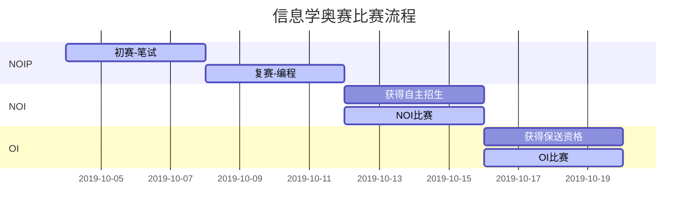

@[TOC](目录)
# NO.01A NOIP的基础知识
## 我们的 NOIp
大家知道的奥数，可以中考，高考加分上大学可以保送（省一等奖），
其实还有四科也有这样的奇效---- ==五大联赛：数学奥赛，物理奥赛，化学奥赛，生物学奥赛，信息学奥赛==。
而信息学人数少、大学青睐、大学好选专业、毕业薪酬高。

## 关于NOI和NOIP
 1. 两者不属于同一个赛事
    - NOIP,全国青少年信息学奥林匹克联赛, 全国统一大纲、统一试卷。初、高中或其他中等专业学校的学生可报名参加联赛。联赛分初赛和复赛两个阶段。初赛考察通用和实用的计算机科学知识，以笔试形式进行; 复赛为程序设计，须在计算机上调试完成。联赛分普及组和提高组两个组别，分别面向初中和高中阶段的学生。
    - NOI,全国青少年信息学奥林匹克竞赛, 是国内包括港澳在内的省级代表队最高水平的大赛, 旨在向在中学阶段的青少年普及计算机科学知识；给学校的信息技术教育课程提供动力和新的思路；给那些有才华的学生提供相互交流和学习的机会；通过竞赛和相关的活动培养和选拔优秀计算机人才。
	
 2. 难度不同
     - NOIP是各省分开考，但考题一样，题目较简单。全国大概有600个一等奖名额，各省一等奖分数线也不一样，而且==不得一等奖是没有什么用的==，一等奖按国家政策可以有保送资格或高考加分资格。
   	 - NOI程序较复杂，考题很难。各省要现各自举办省选，选出最优秀的oiers（各省名额也不一样的），再到指定省份参加全国级别的竞赛，就是全国被选出的oiers要在一起比赛。正式比赛分两试，两天考完，考完后还有交流大会，级别比NOIP要高多了。
   	
 3. 面向对象不同
	- NOIP主要面向于初中和高中阶段的学生。
	- NOI面向中学阶段学习的青少年；
	
## 老师的话
- OI是好学生的游戏
	- “听话出活”
- 	竞赛提供更多的是思维方式和应对方法展示的平台。
	- 我们学习信息学竞赛，事实上是在养成一种学习方法，养成一种思考问题的习惯，使我们在解决其他方面的问题时有章可循。
- Kiss原则，“keep it simple and stupid“----简单就是美。
- 去努力就意味着有失败的风险，如果总是告诉自己还有退路，那么一定不会尽全力，而一旦目标未及，又会说没有尽全力的缘故···  ==所以要对自己负责的全力以赴！==。
- 每个OIer都要相信：即使NOIp的名额只有一个，那也一定是自己。

## 我们会收获什么
1.	想象力和创造力，毅力，审美能力
2.	对问题的理解和分析能力
3.	数学能力和逻辑思维能力
4. 对客观问题和主观思维的口头和书面表达力
5. 团队精神和沟通合作能力

## 课程安排
- ==全部学完需17次课==，每次2节
- 课后**灰木炭**老师会把资料发给大家，回家要整理复习！很重要！
---

# NO.01B 基本编译环境和演示
## 什么是编程？
- **编写程序**，就是让计算机为解决某个问题而使用某种程序设计语言编写程序代码，并最终得到相应结果的过程。
- 信息学竞赛要学的是==算法==

## 简单的例子
	下面有一个通信录：
	159842942 张三
	1398518648 李四
	123456 王五
	21646465 赵六
	658265555刘七
	1383848348冯八
	我们怎么确定13955665出现在这个通信录中？
我们一眼就找到，计算机不会像我们一样思考，而号码有很多很多时，我们也不能一眼就看出来。
**解决问题：**
- 一般做法：逐个比较
- 竞赛做法：先排序，再二分查找
	- 1~3次可找到

**算法意义**
数据量很大时，比如一般方法要比较50万次，而优化算法只需比较25次，这就是算法的意义，这就是我们要学的东西，而且我们要会用计算机语言将预算过程表示出来。

## 我们要学的语言
- C语言是国际上广泛流行的计算机高级语言，又是一种用途广泛、功能强大、使用灵活的过程性编程语言，既可用于编写应用软件，又能用于编写系统软件。
- C++ 读作“C加加”，是“C Plus Plus”的简称。顾名思义，C++ 是在C语言的基础上增加新特性，玩出了新花样，就像 iPhone 7 和 iPhone 7plus的关系。
- 所编写的代码在 Mac、UNIX、Windows、Alpha 计算机上都能通过编译。

## DEV-C++的安装与介绍
工欲善其事，必先利其器
- 腾讯电脑管家->软件管理->搜索C，第5个结果就是”**DEV-C++**”，安装它。
- 360安全卫士->360软件管家->搜索C，第4个结果就是”**Bloodshed Dev-Cpp** ”，安装它。
 
**第一个程序**
文件->新建->源代码，
注意保存的目录，我的是： D:\05Code\06CPP\S01
```cpp
#include <iostream> //头文件iostream包含了cout 函数 
int main(int argc, char** argv) { //main为主函数，入口文件
	std::cout << "Hello world!\n"; //名字空间std里有cout，
	//这里可以加入你的代码
}
```
*注意：代码只支持英文标点符号, 转换为英文标点*：<kbd>ctrl</kbd> + <kbd>.</kbd>
函数：实现了某种功能的代码，以及可以被调用的一段代码。

**第二个程序**
```cpp
#include <iostream> //头文件iostream包含了cout 函数 
int main(int argc, char** argv) { //main为主函数，入口文件
	std::cout<<"4+4="; //也可以使用using namespace std;先声明名字空间
	std::cout<<4+4;
	//std::cout<<"4+4="<<4+4; //合到一行
	//std::cout<<"4+4=\n"<<4+4; //转义字符的使用, \n换行
}
```

*思考我们的程序可以更简化吗？*
```cpp
main() { 
}
```

+(加）、-（减）、*（乘）、/（除）、%（取余）
例：5/2=2（向下取整）  5%3=2


## 尝试以下算式
1. [(123764+2453-2327)*23-78522]%3
	输出格式：
	```计算结果是：XXX（换行）```

2. 输出下面三句话：
	```
	9 * 9=
	99 * 99=
	999 * 999=
	```

*注意：C++中没有中括号和大括号，全用小括号表示*

*[HTML]:   超文本标记语言

