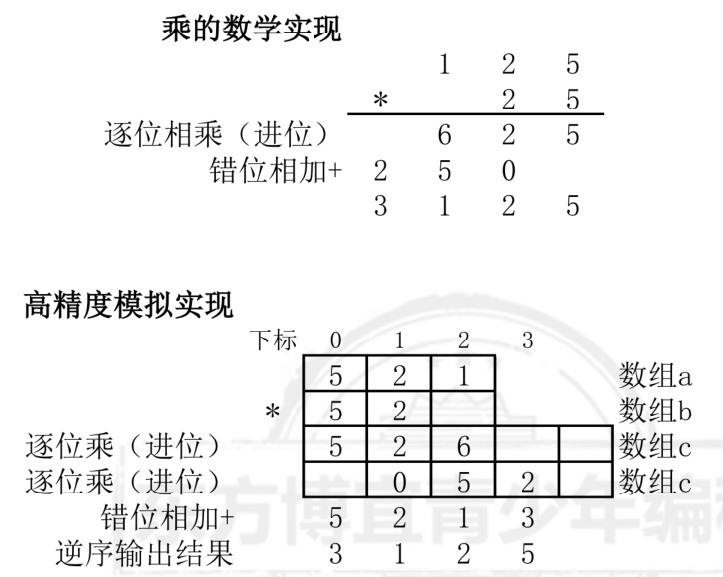

# 第3章 高精度运算

## 3.1 高精度运算的基本知识

### 一、什么是高精度运算？

1、C++的基本类型和范围

| 类型       | 定义   | 大小                                   | 范围                                                         |
| ---------- | ------ | -------------------------------------- | ------------------------------------------------------------ |
| char       | 字符型 | 1 byte                                 | -128~127                                                     |
| short(int) | 短整型 | 2 byte                                 | -32768~32767(-2^15^ ~ 2^15^-1)                               |
| int        | 整形   | 4 byte                                 | -2147483648 ~ 2147483647(-2^31^ ~ 2^31^-1)                   |
| long       | 长整形 | 4 byte(32bit 系统)或8 byte(64bit 系统) | 参考int 和 long long 的范围                                  |
| long long  | 长整形 | 8 byte                                 | -9223372036854775808 ~ 9223372036854775807 (-2^63^ ~ 2^63^-1) |
| float      | 实型   | 4 byte                                 | -(10的38次方)~10的38次方                                     |
| double     | 双精度 | 8 byte                                 | -(10的308次方)~10的308次方                                   |

计算机在存储时，使用的最小单位是 “位”(bit)，一位， 是用来存储一个0或者一个1.
1byte=8位
2、什么是高精度运算
高精度运算，是指参与运算的数（加数，减数， 因子。。...范围大大超出了标准数据类
型(整型，实型)能表示的范围的运算。
博宜青少年编程
例如，求两个200位的数的和。这时， 就要用到高精度算法了。
### 二、高精度运算的基本思路？
基本思路：
(1)由于字符数组可以输入n位， 因此采用字符串（或字符数组） 读入2 个高精度的
数；
(2) 由于加减乘运算都需要从右向左运算 （包括进位），而且要进行整数运算； 因此，
为了方便，我们将2个字符数组逆序存入2 个整数数组；这样既可以从左向右运算 运算和
进位），又可以按照整数格式进行运算， 比较方便；
(3)将计算结果存入第3个数组， 然后按照要求逆序输出结果， 就可以实现高精度运算。
注意：考虑高精度减法、 乘法运算中结果为0的情况。

3.2 高精度运算的实现
一、课堂案例

#### 1268:【基础】高精度加法

思路图解：
以：968+94 为例，数学运算的写法为


在高精度运算中，为了方便模拟右对齐、 从右向左做加法， 以及从右向左进位的过程。
①将2个数逆序、逐位存入2个整数数组， 这样就能实现左对齐；
②然后从左向右做加法以及进位。


```CPP
/*1268 - 【基础】高精度加法
题目描述
计算a+b的值，a,b皆为不超过240位的正整数。

输入
两个正整数，每行一个

输出
一个数，代表两个整数的和

样例
输入
111111111111111111111111111111111111
222222222222222222222222222222222222
输出
333333333333333333333333333333333333
来源
高精度算法

标签
高精度算法
*/
/* s1="968"
s1[O]->a[s1.size()-1]
s1[1]->a[s1.size()-2]
s1[i]->a[s1.size()-i-1] */

#include <bits/stdc++.h>
using namespace std;
/*
第一步：用string读入高精度整数
第二步：将两个高精度整数逆序存入 ab两个整数数组
第三步：从左向右，逐位求和， 结果存入c数组
从左向右，逐位进位
第四步：逆序输出结果
*/
string s1, s2;  //高精度整数
int a[250], b[250], c[500];
int i, j, len;
int main() {
  cin >> s1 >> s2;
  //第二步:将两个高精度整数逆序存入 ab 两个整数数组
  for (i = 0; i < s1.size(); i++) {
    a[s1.size() - i - 1] = s1[i] - '0';
  }
  for (i = 0; i < s2.size(); i++) {
    b[s2.size() - i - 1] = s2[i] - '0';
  }
  //第三步:从左向右,逐位求和,结果存入c数组
  //从左向右,逐位进位
  //加法的次数, 取决于两个整数的较长的字符串
  len = s1.size();
  if (s2.size() > s1.size()) {
    len = s2.size();
  }
  //逐位相加
  for (i = 0; i < len; i++) {
    c[i] = a[i] + b[i];
  }
  //逐位进位
  for (i = 0; i < len; i++) {
    if (c[i] >= 10) {
      c[i + 1] = c[i + 1] + c[i] / 10;
      c[i] = c[i] % 10;
    }
  }
  //第四步:逆序输出结果
  //两个不超过1en位的整数做加法,结果可能是 len+1位
  if (c[len] != 0) {
    len++;
  }
  //逆序输出结果
  for (i = len - 1; i >= 0; i--) {
    cout << c[i];
  }
}
```


#### 1269:[基础]高精度减法

思路图...

思路图解：
如果a>b,结果为正，用a-b运算；如果a<b,结果为负，交换a、b的值，再用a-b运算。
这里假设a>b,则思路如下；

减法的数学实现


减法的高精度模拟实现


```CPP
/*1269 - 【基础】高精度减法
题目描述
高精度减法，求a-b。a,b都是不超过240位的非负整数。

输入
两个非负整数，每行一个。

输出
一个整数，代表两个整数相减之后的结果。

样例
输入
33333333333333333333333333333333333333333
22222222222222222222222222222222222222222
输出
11111111111111111111111111111111111111111
来源
高精度算法

标签
高精度算法
*/
#include <bits/stdc++.h>
using namespace std;
/*
高精度减法：
第一步：判断正负， 如果s1比s2对应的整数小，结果为负， 交换s1 s2
第二步：将两个字符串，逆序存入2 个整数输出测试
第三步：从左至右，逐位相减，不够借位
第四步：从右向左，逆序输出
*/
string s1, s2;
int a[250], b[250], c[250];
int i, len, p;
char f = '+';  //表示结果的正负
int main() {
  cin >> s1 >> s2;
  //长的一定大,一样长的字典码大的一定大
  //"123" "3" "123" "125"
  if (s1.size() < s2.size() || (s1.size() == s2.size() && s1 < s2)) {
    f = '-';
    swap(s1, s2);  //直接交换两个变量的值
  }
  // cout<<f<<""<<s1<<""<<s2;
  //将s1和s2逆序存入整数数组
  for (i = 0; i < s1.size(); i++) {
    // 0 -> s1[s1.size()-1]
    // 1 -> s1[s1.size()-2]
    a[i] = s1[s1.size() - i - 1] - '0';
  }
  for (i = 0; i < s2.size(); i++) {
    b[i] = s2[s2.size() - i - 1] - '0';
  }
  //逐位相减
  len = s1.size();
  for (i = 0; i < len; i++) {
    //如果不够减,向右借1,当10用
    if (a[i] < b[i]) {
      a[i + 1] --;
      a[i] += 10;
    }
    c[i] = a[i] - b[i];
  }
  //判断是否要输出负号
  if (f == '-') cout << f;
  //从右向左逐位输出，从第一个遇到的非 0元素开始输出
  for (i = len - 1; i >= 0; i--) {
    if (c[i] != 0) {
      p = i;
      break;
    }
  }
  //逆序从第一个非 0元素 输出每一位
  for (i = p; i >= 0; i--) {
    cout << c[i];
  }
}
```


1286:【基础】高精度乘单精度


1287 - 【基础】高精度乘




1287 - 【基础】高精度乘


```CPP
/*1287 - 【基础】高精度乘
题目描述
高精度乘，求两个很大的非负整数相乘的结果。

输入
2个非负整数，每个一行，每个整数不超过240位。

输出
一个整数，表示相乘的结果。

样例
输入
1111111111111111111111111
2222222222222222222222222
输出
2469135802469135802469135308641975308641975308642
来源
高精度算法

标签
高精度算法
*/
#include <bits/stdc++.h>
using namespace std;
string s1, s2;
int a[250], b[250], c[500];
int i, j, p;
int main() {
  cin >> s1 >> s2;
  //逆序将s1和s2存入ab数组
  for (i = 0; i < s1.size(); i++) {
    a[i] = s1[s1.size() - i - 1] - '0';
  }

  for (i = 0; i < s2.size(); i++) {
    b[i] = s2[s2.size() - i - 1] - '0';
  }
  //循环a数组的每一位,用 a[i]去乘以b数组的每一位b[j]
  //结果错位加到c数组的c[i+j]这一位上
  for (i = 0; i < s1.size(); i++) {
    for (j = 0; j < s2.size(); j++) {
      c[i + j] += a[i] * b[j];
      //进位
      if (c[i + j] >= 10) {
        c[i + j + 1] += c[i + j] / 10;
        c[i + j] %= 10;
      }
    }
  }
  //逆序输出，逆序从第一个非 0 元素位置开始输出
  for (i = s1.size() + s2.size() - 1; i >= 0; i--) {
    if (c[i] != 0) {
      p = i;
      break;
    }
  }
  for (i = p; i >= 0; i--) {
    cout << c[i];
  }
}
```


1271 - 【基础】高精度整数除法


```CPP
/*1271 - 【基础】高精度整数除法
题目描述
求a/b的结果。 已知a，b为10^8范围内的非负整数，求a/b保留前n位小数商的结果。
（5.1.72）

输入
a b n

输出
一行数字

样例
输入
97 61 50
输出
1.59016393442622950819672131147540983606557377049180
来源
高精度算法

标签
高精度算法
*/
#include <bits/stdc++.h>
using namespace std;
int main() {
  int a, b, i, n, t;
  cin >> a >> b >> n;
  cout << a / b << ".";
  t = a % b;
  for (i = 1; i <= n; i++) {
    t *= 10;
    cout << t / b;
    t %= b;
  }
}
```


1280:
【基础】求2的n次方
a 整数数组，存放2 的 n 次方


思路：
准备一个整数数组 a，存放 2 的 n 次方， a 数组默认存储一个1，代表2的0次方！
循环n次，每次循环都要将 a 数组的每一位* 2，并进位，
然后判断 a 数组*2 后是否多出一位，如果多出一位，a 数组位数计数器 k++。
逆序输出 a 数组的 k 个数。

```CPP
/*1280 - 【基础】求2的n次方
题目描述
求2的n次方！（0<=n<=100）

输入
从键盘读入一个整数n！

输出
请输出2的n次方！

样例
输入
100
输出
1267650600228229401496703205376
来源
高精度算法

标签
高精度算法
*/
#include <bits/stdc++.h>
using namespace std;
int a[100] = {1};
int main() {
  int n, k = 1;  // k存储乘积的位数
  cin >> n;
  for (int i = 0; i < n; i++) {    //循环n次，每次数组*2
    for (int j = 0; j < k; j++) {  //每一位*2
      a[j] *= 2;
    }
    for (int j = 0; j < k; j++) {  //进位
      if (a[j] >= 10) {
        a[j + 1] += a[j] / 10;
        a[j] %= 10;
      }
    }
    if (a[k] > 0) k++;  //判断是否多出一位
  }
  for (int i = k - 1; i >= 0; i--) cout << a[i];  //逆序输出
  return 0;
}

```


### **1281 - 【基础】求2+2\*2+2\*2\*2+…+2\*2\*2\*….\*2**


```CPP
/*1281 - 【基础】求2+2*2+2*2*2+…+2*2*2*….*2
题目描述
求2+2*2+2*2*2+…+2*2*2*…*2的和是多少？最后一项有多少2相乘由键盘读入的n决定（1<=n<=100）！
比如：n=3，那么s=2+2*2+2*2*2=14！
输入
从键盘读入一个整数n（1<=n<=100）
输出
输出求出的和

样例
输入
3
输出
14
来源
高精度算法

标签
高精度算法
*/
#include <bits/stdc++.h>
using namespace std;
int a[100] = {1}, b[100];
int main() {
  int n, ak = 1, bk = 1, len;  // ak存储乘积a的位数,bk存储乘积总和b的位数
  cin >> n;
  for (int i = 0; i < n; i++) {     //循环n次，每次数组*2
    for (int j = 0; j < ak; j++) {  //每一位*2
      a[j] *= 2;
    }
    for (int j = 0; j < ak; j++) {  //进位
      if (a[j] >= 10) {
        a[j + 1] += a[j] / 10;
        a[j] %= 10;
      }
    }
    if (a[ak] > 0) ak++;  //判断是否多出一位
    //将k位的a加到s位的b
    len = ak;
    if (bk > ak) len = bk;
    for (int j = 0; j < len; j++) {
      b[j] += a[j];
      if (b[j] >= 10) {  //进位
        b[j + 1] += b[j] / 10;
        b[j] %= 10;
      }
    }
    if (b[bk] > 0) bk++;
  }
  for (int i = bk - 1; i >= 0; i--) cout << b[i];  //逆序输出
  return 0;
}
```

二、作业
1285:【基础】计算N的阶乘
1296:【基础】求1!+2!+3!+4!+..+n!
1409:【基础】棋盘里的麦子？
1369:【提高】Pell 数列
附加题：

1532:【提高】小X与神牛
