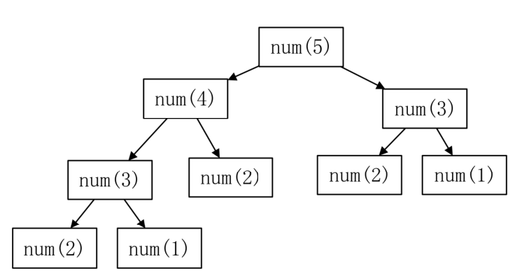

## 4.1 递推基础

### 一、什么是递推

递推算法是一种用若干步可重复运算来描述复杂问题的方法， 递推法是一种重要的数学方法， 也是编程中解决问题的一个重要方法。
这种算法特点是： 一个问题的求解需一系列的计算， 在已知条件和所求问题之间总存在着某种相互联系的关系，在计算时， 如果可以找到前后过程之间的数量关系 (即递推式），那么，从问题出发逐步推到已知条件。

无论顺推还是逆推， 其关键是要找到递推式。
这种处理问题的方法能使复杂运算化为若干步重复的简单运算， 充分发挥出计算机擅长于重复处理的特点。
递推算法的首要问题是得到相邻的数据项间的关系( 即递推关系)。递推算法避开了求通项公式的麻烦， 把一个复杂的问题的求解，分解成了） 连续的若干步简单运算。一般说来， 可以将递推算法看成是一种特殊的迭代算法 。


## 4.2 递推问题训练
一、简单数值型递推

#### 1238:【入门】统计每个月兔子的总数
第1个月：a	1
第2个月：a	1
第 3 个月：ab	2
第 4 个月：abc	3
第 5 个月：abcde	5
请问，数列的规律是什么？
规律：a(n) = a(n-1)+ a(n-2) （斐波拉契数列）
注意交代2个起始项(第1项和第 2 项)

```cpp
/*1238 - 【入门】统计每个月兔子的总数
题目描述
有一对兔子，从出生后第3个月起每个月都生一对兔子，一对小兔子长到第三个月后每个月又生一对兔子，假如兔子都不死，问第n个月（n<=50）的兔子总数为多少对？

输入
输入1个整数n，表示第几个月

输出
第n个月兔子的总数量有多少对？

样例
输入
9
输出
34
来源
递归 递推

标签
递归递推
*/
#include <bits/stdc++.h>
using namespace std;
/*
求斐波拉契数列第n项的值
A(n)=A(n-1)+A(n-2)
1 1 2 3 5 8
*/
int num(int n) {
  int r;
  //递归的出口（起始项）
  if (n == 1 || n == 2) {
    r = 1;
  } else {
    r = num(n - 1) + num(n - 2);
  }
  return r;
}
int main() {
  int n, x;
  cin >> n;
  x = num(n);
  cout << x << endl;
}
```

注意：
(1)当n的值越来越大， 执行时间会越来越长，直到超时！
因为随着n的值越来越大，重复求解的项会越来越多，这棵“树” 会越来越大，因此会非常耗时！


(2) int 最多表达到 
$$
2^{31}-1 
$$
,10 位的整数， 如果超过这个范围，需要使用 long long 来表达，long long 最多表达到 
$$
2^{63}-1
$$
, 约 20 位的整数。

> 注意：递归存在的问题
> 由于递归是函数对于自己的调用，因此在n 的值比较大时， 存在太多的重复求解的过程，而且这些重复求解的过程都必须等所有项计算完毕， 才能汇总出总解；因此效率很低。

改进：使用数组和递推的方法来提高递归的效率

**改进方案一**： 采用数组来记录每个月兔子的数量， 这样的话，如果要知道 a[n-1]和 a[n-2]就
不需要再次求解了， 而是直接从数组中获取。

| 1    | 1    | 2    | 3    | 5    |      |      |      |
| ---- | ---- | ---- | ---- | ---- | ---- | ---- | ---- |

数组的每个单元格用来存放每个月兔子有多少对！

```cpp
#include <bits/stdc++.h>
using namespace std;
int main(){
    long long a[60],i,n;
    cin>>n;
    //第一个月和第二个月是已知的
    a[1] = 1;
    a[2] = 1;
    //从第3个月开始求解
    for(i = 3;i <= n;i++){
    	a[i] = a[i - 1] + a[i - 2];
    }
    cout<<a[n]<<endl;
}
```

**改进方案二**：采用两个变量x 和 y 分别记录第 n-1 个月和第 n-2 个月兔子的数量。

| 1    | 1    | 2    | 3    | 5    |      |      |      |
| ---- | ---- | ---- | ---- | ---- | ---- | ---- | ---- |

​		x		y		z

```cpp
  /*
  A(n)=A(n-1)+A(n-2)
  */
  // x y 代表第 n 个月的前两个月兔子的数量，r 代表第 n 个月兔子的数量
  long long x, y, r, i, n;
  cin >> n;
  x = 1;  //第 1 个月
  y = 1;  //第 2 个月
  for (i = 3; i <= n; i++) {
    r = x + y;  //第 x 个月
    x = y;
    y = r;
  }
  //如果是问第一个月或者第二个月
  if (n == 1 || n == 2) {
    cout << 1 << endl;
  } else {
    cout << r << endl;
  }
}
```


#### 1082:【入门】猴子吃桃子
思路：采用逆推法求解！

```CPP
/*1082 - 【入门】猴子吃桃子
题目描述
猴子吃桃子问题：猴子第一天摘下若干个桃子，当即吃了一半还不过瘾，又多吃了一个；
第二天又将剩下的桃子吃掉一半又多吃了一个；
以后每天早上都吃了前一天剩下的一半零一个。
到了第十天想再吃时，见只剩下一个桃子，求第一天共摘了多少个桃子？

输入
无

输出
一个整数，第一天共有多少个桃子

来源
需要找规律的循环

标签
需要找规律的循环
*/
#include <bits/stdc++.h>
using namespace std;
int main() {
  int x, i;
  x = 1;  //第 10 天
  //逆推
  for (i = 2; i <= 10; i++) {
    x = (x + 1) * 2;
  }
  cout << x;
}

```


#### 1148:【入门】数数小木块
思路：递推出第i层小木块的数量， 求和！
```CPP
/*1148 - 【入门】数数小木块
题目描述
在墙角堆放着一堆完全相同的正方体小木块，如下图所示：
因为木块堆得实在是太有规律了，你只要知道它的层数就可以计算所有木块的数量了。

输入
只有一个整数 n ，表示这堆小木块的层数，已知1 <= n <= 100 。
输出
只有一个整数，表示这堆小木块的总数量。

样例
输入
5
输出
35
来源
函数问题 递归

标签
函数问题递归
*/
#include <bits/stdc++.h>
using namespace std;
int i, x, s, n;  // x 代表第 i 层小木块的数量
int main() {
  cin >> n;
  // An = An-1 + n
  // Ai = Ai-1 + i
  // x=x+n
  x = 1;  //第1层
  s = 1;  //第1层总共有多少个
  //从第2层开始递推
  for (i = 2; i <= n; i++) {
    x += i;
    // cout<<x<<" ";
    s += x;
  }
  cout << s;
}
```

## 4.3 递推问题应用
### 一、课堂案例
#### 1216:

【基础】数塔问题
思路：将数塔存入二 维数组， 从倒数第二层开始， 递推计算出走到每个点最多能够累计的最
大数字和是多少，直到第 1 层， 就能求出所经过结点的数字和的最大值！


```CPP
/*1216 - 【基础】数塔问题
题目描述
有如下所示的数塔，要求从底层走到顶层，若每一步只能走到相邻的结点，则经过的结点的数字之和最大是多少？

输入
输入数据首先包括一个整数整数N(1 <= N <=
100)，表示数塔的高度，接下来用N行数字表示数塔，其中第i行有个i个整数，且所有的整数均在区间[0,99]内。

输出
从底层走到顶层经过的数字的最大和是多少？

样例
输入
5
7
3 8
8 1 0
2 7 4 4
4 5 2 6 5
输出
30
来源
递推 动态规划

标签
递推动态规划
*/
#include <bits/stdc++.h>
using namespace std;
int a[110][110];  //存储数塔
int i, j, n;
int main() {
  cin >> n;
  //读入第i 层的i 个数
  for (i = 1; i <= n; i++) {
    for (j = 1; j <= i; j++) {
      cin >> a[i][j];
    }
  }
  //从倒数第 2 层开始逆推， 每个点累加上下方的值和 下方右边的值中的较大数
  for (i = n - 1; i >= 1; i--) {
    for (j = 1; j <= i; j++) {
      // if (a[i + 1][j] > a[i + 1]) {
      // a[i][j] = a[i][j] + a[i+1][j];
      //} else {
      // a[i][j] = a[i] + a[i + 1];
      //  }
      a[i][j] = a[i][j] + max(a[i + 1][j], a[i + 1][j + 1]);
    }
  }
  cout << a[1][1];
}
```


#### 1410:【基础】数塔的行走路径？
思路：
第一步：将数塔存入二维数组， 从倒数第二层开始， 递推计算出走到每个点最多能够累计的
最大数字和是多少，直到第 1 层， 就能求出所经过结点的数字和的最大值！
第二步：倒过来推导一下， 每一个数是从哪个点来的， 记录下点对应的值，再次逆序输出。


```CPP
/*1410 - 【基础】数塔的行走路径？
题目描述
有如下所示的数塔，要求从底层走到顶层，若每一步只能走到相邻的结点，要求经过结点的数字之和最大，请问应该如何走，请输出从塔底到塔顶的行走路线，同时计算出经过结点的最大数字和是多少？
（假设本问题中，不存在多条路线从塔底走到塔顶经过结点的数字和都是最大的，也就是本题涉及测试数据得到的路径都是唯一的）
为了方便计算我们将数塔中的值存到如下图所示的二维数组中，该数塔的行走路线将如下图的箭头所示。

输入
输入数据首先包括一个整数整数N(1 <= N <=
100)，表示数塔的高度，接下来用N行数字表示数塔，其中第i行有个i个整数，且所有的整数均在区间[0,99]内。
输出
第一行，按照样例输出所示的形式，输出数塔的行走路线。
第二行，输出经过结点的最大数字和。

样例
输入
5
7
3 8
8 1 0
2 7 4 4
4 5 2 6 5
输出
5,2->4,2->3,1->2,1->1,1
30
来源
递推

标签
递推
*/
#include <bits/stdc++.h>
using namespace std;
/*
思路：
第一步：采用逆推法， 计算出走到每个点经过的数字和的最大值 ;
第二步：从第一层开始逐层向下计算（递推）， 算出每个点是从下方来的
还是下方的右侧来的， 将路线记录到数组中
*/
int a[110][110];  //存储数塔， 以及走到每个点的最大和的结果
int r[110][3];    //存储路线
int i, j, n, k;   // k 表示 r 数组的下标
int main() {
  cin >> n;
  //读入数塔
  for (i = 1; i <= n; i++) {
    for (j = 1; j <= i; j++) {
      cin >> a[i][j];
    }
  }
  //计算走到每个点经过的数字最大和
  for (i = n - 1; i >= 1; i--) {
    for (j = 1; j <= i; j++) {
      a[i][j] = a[i][j] + max(a[i + 1][j], a[i + 1][j + 1]);
    }
  }
  //计算路径
  //第一个点，也就是终点，不需要计算
  k = 1;
  r[1][1] = 1;
  r[1][2] = 1;
  //表示当前正在计算的点
  i = 1;
  j = 1;
  //推导第2 行的点是从哪个点上来的， 直到第 n 行，就结束
  while (i < n) {
    k++;
    if (a[i + 1][j] > a[i + 1][j + 1]) {
      r[k][1] = i + 1;
      r[k][2] = j;
      i++;
    } else {
      r[k][1] = i + 1;
      r[k][2] = j + 1;
      i++;
      j++;
    }
  }
  //逆序从底到顶打印路线
  for (i = k; i >= 1; i--) {
    cout << r[i][1] << "," << r[i][2];
    //除了第 1 行以外，都有->
    if (i != 1) {
      cout << "->";
    }
  }
  cout << endl << a[1][1];
}
```


#### 1224:【提高】过河卒
第1行( i==0 ) 和第1列 ( j=0 ) 的走法确定的
其余的点，走到 a[ i ] [j]点的路径条数 = a [ i-1 ] [j] + a[i] [j-1]
	0					1						2

| 1    | 1    | 1    |
| ---- | ---- | ---- |
| 1    | 2    | 3    |
| 1    | 3    | 6    |


思路：
将棋盘所有值设置为 1
标记马及马的控制点为 0
a[0] [0]不需要计算，除此以外
i=0，第 1 行，除了控制点， a[i] [j]等于左侧的值
j=0，第 1 列，除了控制点， a[i] [j]等于上方的值
其余的点，除了控制点， a[i] [j]=左侧+上方的值

```CPP
/*1224 - 【提高】过河卒
题目描述
A 点有一个过河卒，需要走到目标 B
点。卒行走规则：可以向下、或者向右。同时在棋盘上的任一点有一个对方的马（如下图的C点），该马所在的点和所有跳跃一步可达的点称为对方马的控制点。例如下图
C 点可以控制 9 个点（图中的P1，P2 … P8 和 C）。卒不能通过对方马的控制点。
棋盘用坐标表示，现给定A 点位置为（0,0）B 点位置为（n,m）(n,m 为不超过 10
的整数)，马的位置为C（X,Y）（约定:
C点与A点不重叠，与B点也不重叠）。要求你计算出卒从 A 点能够到达 B
点的路径的条数。

输入
B点的坐标（n,m）以及对方马的坐标（X,Y）（马的坐标一定在棋盘范围内，但要注意，可能落在边界的轴上）

输出
样例
输入
6 6 3 2
输出
17
来源
递推

标签
递推
*/
#include <bits/stdc++.h>
using namespace std;
/*
将棋盘所有值设置为 1
标记马及马的控制点为0
a[0][0]不需要计算，除此以外
i=0，第 1 行，除了控制点， a[i][j]等于左侧的值
j=0，第 1 列，除了控制点， a[i][j]等于上方的值
其余的点，除了控制点， a[i]=左侧+上方的值
*/
int main() {
  int a[30][30];  //存放棋盘的值，默认初值都为 0
  int n, m, x, y, i, j;
  cin >> n >> m >> x >> y;
  //将棋盘所有值设为1
  for (i = 0; i <= n; i++) {
    for (j = 0; j <= m; j++) {
      a[i][j] = 1;
    }
  }
  //设置马及马的控制点为 0
  a[x][y] = 0;
  //如果控制点在棋盘内，则设置为 0
  if (x - 1 >= 0 && y - 2 >= 0) a[x - 1][y - 2] = 0;
  if (x - 2 >= 0 && y - 1 >= 0) a[x - 2][y - 1] = 0;
  if (x - 2 >= 0 && y + 1 <= m) a[x - 2][y + 1] = 0;
  if (x - 1 >= 0 && y + 2 <= m) a[x - 1][y + 2] = 0;
  if (x + 1 <= n && y + 2 <= m) a[x + 1][y + 2] = 0;
  if (x + 2 <= n && y + 1 <= m) a[x + 2][y + 1] = 0;
  if (x + 2 <= n && y - 1 >= 0) a[x + 2][y - 1] = 0;
  if (x + 1 <= n && y - 2 >= 0) a[x + 1][y - 2] = 0;
  // for (i = 0; i <= n; i++) {
  // for (j = 0; j <= m; j++) {
  // cout << a[i][j] << "";
  // }
  // cout << endl;
  //}
  //递推计算
  for (i = 0; i <= n; i++) {
    for (j = 0; j <= m; j++) {
      if (i == 0 && j == 0) {
        //略过本次循环下方的语句直接开始 下一个循环
        continue;
      }
      //马的控制点不需要计算
      if (a[i][j] == 0) {
        continue;
      }
      //如果是第1行
      if (i == 0) {
        a[i][j] = a[i][j - 1];
        // 每个点的值 = 左侧的值
      } else if (j == 0) {
        //第 1 列，每个点的值 = 上方的值
        a[i][j] = a[i - 1][j];
      } else {
        //其余点(不包括第1行第1列及马的控制点)
        a[i][j] = a[i][j - 1] + a[i - 1][j];
      }
    }
  }
  cout << a[n][m];
}
```


#### 1369:【提高】Pell 数列


A2=A1*2+0

A3=A2*2+1

A4=A3*2+5

A5=A4 *2 + 12

An=An-1 * 2 + A(n-2)

```CPP
/*1369 - 【提高】Pell数列
题目描述
有一种数列，它的前10项的值分别为：1 2 5 12 29 70 169 408 985
2378，这个数列被称为Pell数列，请问该数列的第n项的值是多少？（n<=1000）

输入
一个整数n。
输出
第n项的值。

样例
输入
10
输出
2378
来源
递推

标签
递推
*/

#include <bits/stdc++.h>
using namespace std;
/*
An = A(n-1)*2 + A(n-2)
*/
//求两个高精度的整数的和
string he(string s1, string s2) {
  string r;  //存放总和
  int a[1000] = {0};
  int b[1000] = {0};
  int c[1000] = {0};
  //逆序存入整数数组
  int i;
  for (i = 0; i < s1.size(); i++) {
    a[i] = s1[s1.size() - i - 1] - '0';
  }
  for (i = 0; i < s2.size(); i++) {
    b[i] = s2[s2.size() - i - 1] - '0';
  }
  //逐位相加,逐位进位
  int len = s1.size();
  if (s2.size() > s1.size()) len = s2.size();

  for (i = 0; i < len; i++) {
    c[i] = c[i] + a[i] + b[i];
    if (c[i] >= 10) {
      c[i + 1] = c[i + 1] + c[i] / 10;
      c[i] = c[i] % 10;
    }
  }
  //判断是否多出1位
  if (c[len] != 0) len++;
  //逆序将c数组拼接乘字符串
  for (i = len - 1; i >= 0; i--) {
    //将 c[i]+'0'这个 ascii 码强制转换为 char 类型
    r = r + (char)(c[i] + '0');
  }
  return r;
}
//求一个高精度的整数 * 2 的积
string cheng(string s) {
  string r;
  int a[1000] = {0};
  int i;
  //逆序存入a 数组
  for (i = 0; i < s.size(); i++) {
    a[i] = s[s.size() - i - 1] - '0';
  }
  //逐位*2
  for (i = 0; i < s.size(); i++) {
    a[i] = a[i] * 2;
  }

  //逐位进位
  for (i = 0; i < s.size(); i++) {
    if (a[i] >= 10) {
      a[i + 1] = a[i + 1] + a[i] / 10;
      a[i] = a[i] % 10;
    }
  }
  //判断是否多一位
  int len = s.size();
  if (a[len] != 0) len++;
  //逆序拼接到字符串r上
  for (i = len - 1; i >= 0; i--) {
    r = r + to_string(a[i]);
  }
  return r;
}
int main() {
  // z:代表计算结果,xy 代表 z 的前两项
  string x, y, z;
  int i, n;
  cin >> n;
  // A(n)=A(n-1)*2+A(n-2)
  x = "1";
  y = "2";
  if (n == 1) {
    cout << x;
  } else if (n == 2) {
    cout << y;
  } else {
    //从第 3 项开始递推
    for (i = 3; i <= n; i++) {
      z = he(cheng(y), x);
      //修改 xy 的值，逐步向后推导
      x = y;
      y = z;
    }
    cout << z;
  }
}
```


### 二、作业
1298:【基础】摘花生问题
1374:【基础】 摘花生问题(2)
1368:【提高】蜜蜂路线
1367:【入门】 骨牌铺方格
1539:【入门】 小X放骨牌
1366:【基础】平面分割问题

