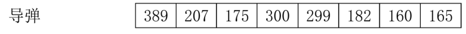
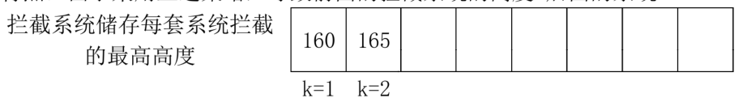
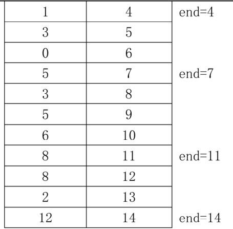

# 第5章 贪心
## 5.1 贪心基础
### 一、什么是贪心
贪心算法(又称贪婪算法)是指， 在对问题求解时，总是做出在 当前看来是最好的选择。
也就是说，不从整体最优上加以考虑， 他所做出的是在某种意义 上的局部最优解。
    贪心算法不是对所有问题都能得到整体最优解， 关键是贪心策略的选择，选择的贪心策
略必须具备无后效性， 即某个状态以前的过程不会影响以后的状态，只与当前状态有关。
    贪心算法的使用前提: 局部最优解一定能导致全局最优解。
学过的贪心问题:数塔、摘花生、 过河卒!
贪心的解决策略:
过程
1、建立数学模型来描述问题;
2、把求解的问题分成若干个子问题;
3、对每一子问题求解，得到子问题的局部最优解;
4、把子问题的解局部最优解合成原来解问题的一个解。

## 5.2 贪心习题训练

### 一、课堂案例
#### 1326:[入门]需要安排几位师傅加工零件?

思路:由于题目要求的是最少需要多少师傅来加工零件， 因此我们优先挑选加工能力强的师
傅来加工零件。

```CPP
/*1326 - 【入门】需要安排几位师傅加工零件？
题目描述
某工厂有n个零件加工的师傅，每位师傅每天能够加工出不同数量的零件。
现有m个零件要求一天加工完，请问该工厂最少需要派几个师傅来完成这次零件加工任务，
如果安排所有的师傅都参与加工也不能在一天内完成任务，请输出“NO”。（4.2.71）

输入
第一行有两个整数，用空格隔开；第一个整数代表要加工的总零件个数m（m<=10^6），
    第二个整数代表工厂的零件加工师傅的数量n（n<=100）。
第二行有n个整数，分别代表每个师傅每天能够加工出来的零件数量（每个师傅每天加工的零件数量<=10^4）。

输出
工厂在1天时间内加工所有零件需要的师傅数量或者输出NO。

样例
输入
10 5
1 3 2 4 2
输出
4
来源
数组问题

标签
数组问题
*/
#include <bits/stdc++.h>
using namespace std;
//辅助降序排序的函数
bool cmp(int a, int b) {
  if (a > b)
    return true;
  else
    return false;
}
int a[110], i, s, n, m;
int main() {
  cin >> m >> n;
  //读入 n 个帅傅的加工能力
  for (i = 1; i <= n; i++) {
    cin >> a[i];
  }
  //对 n 个师傅的加工能力进行排序
  sort(a + 1, a + n + 1, cmp);
  //逐个求和
  for (i = 1; i <= n; i++) {
    s = s + a[i];
    //人数是否足够
    if (s >= m) {
      cout << i;
      break;
    }
  }
  //如果所有师傅都来加工人数也不够
  if (s < m) {
    cout << "NO";
  }
}
```


#### 1228【基础】排队打水问题


```CPP
/*1228 - 【基础】排队打水问题
题目描述
有n个人排队到r个水龙头去打水，他们装满水桶的时间t1,t2,...,tn为整数且各不相等，
应如何安排他们的打水顺序才能使他们花费的总时间最少？
每个人打水的时间 = 排队的时间 + 实际打水的时间，本题假设一个人打好水，
排在他后面的人接着打水的这个切换过程不消耗时间。
比如，有2个人A和B，他们打水的时间分别是3和2，只有1个水龙头，
这时，如果A先打水，B后打水，那么A和B打水的时间分别为3、3+2（B排队3分钟）。
因此，所有人打水的总时间就是每个人的打水时间及每个人的排队时间的总和。

输入
第1行，两个整数n(1<=n<=500)和r(1<=r<=100)。
第2行，n个正整数t1,t2,...,tn，(1<=ti<=1000)表示每个人装满水桶的时间。

输出
1行，一个正整数，表示他们花费的最少总时间。

样例
输入
4 2
2 6 4 5
输出
23
来源
贪心

标签
贪心
*/
```


每个人的总打水时间 = 该用户打水时间 + 排队等待时间， 因此只有打水快的人先打，总
的排队时间才是最少的。
假设有 6 个人，打水时间分别为:2 5 8 6 4 9，最少总打水时间是多少?


前r个人不需要排队，从第r+1个人开始，a[i]=a[i]+a[i-r]
a[3]=a[3]+a[1]
a[4]=a[4]+a[2]
a[5]=a[5]+a[3]
a[6]=a[6]+a[4]

```CPP
#include <bits/stdc++.h>
using namespace std;
int a[510], r, i, n, s;
int main() {
  cin >> n >> r;
  //读入n个人的打水时间
  for (i = 1; i <= n; i++) {
    cin >> a[i];
  }
  //打得快的人先打,对打水时间升序排序
  sort(a + 1, a + n + 1);
  //计算每个人的总打水时间
  for (i = 1; i <= n; i++) {
    //从第r+1个人开始要重新计算每个人的总打水时间
    if (i >= r + 1) {
      a[i] += a[i - r];  //把他前r位置打水时间加到自己等待时间上来。
    }
    s += a[i];
  }
  cout << s;
}
```


1229:【提高】拦截导弹的系统数量求解

思路：找当前拦截系统中，高度最矮的系统拦截当前的导弹！



拦截策略：如果没有系统能够拦截，则开一个系统，修改系统高度如果有系统能够拦截，则找当前拦截高度最矮（第一个能拦截的）的系统进行拦截，修改系统高度为当前导弹的高度
特点：由于采用上述策略，导致前面的拦截系统的高度<后面的系统



```CPP
/*1229 - 【提高】拦截导弹的系统数量求解
题目描述
某国为了防御敌国的导弹袭击，发展出一种导弹拦截系统。但是这种导弹拦截系统有一个缺陷：虽然它的第一发炮弹能够到达任意的高度，但是以后每一发炮弹都不能高于前一发的高度。
假设某天雷达捕捉到敌国的导弹来袭。由于该系统还在试用阶段，所以只有一套系统，因此有可能不能拦截所有的导弹。
输入n个导弹依次飞来的高度（给出的高度数据是不大于30000的正整数），计算如果要拦截所有导弹最少要配备多少套这种导弹拦截系统。
比如：有8颗导弹，飞来的高度分别为
389 207 175 300 299 170 158 165
那么需要2个系统来拦截，他们能够拦截的导弹最优解分别是： 系统1：拦截 389 207 175
170 158 系统2：拦截 300 299 165

输入
两行，第一行表示飞来导弹的数量n（n<=1000）

第二行表示n颗依次飞来的导弹高度

输出
要拦截所有导弹最小配备的系统数k

样例
输入
8
389  207  175  300  299  170  158  165
输出
2
来源
贪心

标签
贪心
*/
#include <bits/stdc++.h>
using namespace std;  // x:代表每个导弹的高度
// p:找到的能拦截导弹的系统的下标
// k:a数组中已经有的能够拦截导弹的系统数量
int a[1010], i, n, x, p, k, j;
int main() {
  cin >> n;
  for (i = 1; i <= n; i++) {
    cin >> x;
    p = -1;
    // 循环a数组，找到第一个能够拦截的系统
    for (j = 1; j <= k; j++) {
      if (a[j] >= x) {
        p = j;
        break;
      }
    }
    //如果没找到系统拦截
    if (p == -1) {
      k++;
      a[k] = x;  //设定系统能拦截的最高高度
    } else {
      //用第p个系统拦截，修改系统的最高高度
      a[p] = x;
    }
  }
  cout << k;
}
```

思考：如果要记录第几个系统拦截了哪些飞弹，应该如何解？


#### 1372:【基础】活动选择
我们使用的贪心策略如下。即每一步总是选择这样的活动来占用资源：使得余下的未调度时间最大化，使得兼容的活动尽可能多。为了达到这个目的，我们将个待选活动按结束时间递增的顺序排序：e1’<=e2’<=…<=en’。



```CPP
/*1372 - 【基础】活动选择
题目描述
学校在最近几天有n（n<=100）个活动，这些活动都需要使用学校的大礼堂，在同一时间，礼堂只能被一个活动使。由于有些活动时间上有冲突，学校办公室人员只好让一些活动放弃使用礼堂而使用其他教室。

现在给出n个活动使用礼堂的起始时间begini和结束时间endi(begini <
endi)，请你帮助办公室人员安排一些活动来使用礼堂，要求安排的活动尽量多。请问最多可以安排多少活动？

请注意，开始时间和结束时间均指的是某个小时的0分0秒，如：3
5，指的是3:00~5:00，因此3 5和5 9这两个时间段不算冲突的时间段。

输入
第一行一个整数n(n<=100)

接下来的n行，每行两个整数，第一个begini，第二个是endi(begini< endi  <=32767)

输出
输出最多能安排的活动数

样例
输入
11
3 5
1 4
12 14
8 12
0 6
8 11
6 10
5 7
3 8
5 9
2 13
输出
4
来源
贪心 结构体

标签
贪心结构体区间问题
*/
#include <bits/stdc++.h>
using namespace std;
/*
要求安排的活动尽量多。请问最多可以安排多少活动
安排活动的策略：尽可能选择结束时间早的活动
第一步：将结束时间，按照升序排序，开始时间要做联动排序
第二步：选择第一个活动的结束end时间为依据，向下找到第一个开始时间>=end
的活动为第2个活动，以此类推
*/
int b[110], e[110];
// c:计数器，计算最多能够排多少个活动
int n, i, j, c;
int main() {
  cin >> n;
  //读入n个活动
  for (i = 1; i <= n; i++) {
    cin >> b[i] >> e[i];
  }
  // 对n个活动的起止时间，按照结束时间升序排序
  for (i = 1; i <= n - 1; i++) {
    //第i轮，从下标为1的数，排到下标为n-i
    for (j = 1; j <= n - i; j++) {
      if (e[j] > e[j + 1]) {
        swap(e[j], e[j + 1]);
        swap(b[j], b[j + 1]);
      }
    }
  }
  // for (i = 1ji < nji++) {
  // cout << b[i] << "" << e[i] << endl;
  //  }
  int end = e[1];  //第一个活动一定会选到
  c = 1;
  for (i = 2; i <= n; i++) {
    //找到b[i]>=end的活动，选择它
    if (b[i] >= end) {
      c++;
      end = e[i];
    }
  }
  cout << c;
}
```


二、作业
1375:【提高】拦截导弹方案求解
1373:【基础】删数问题
1371:【基础】均分纸牌
1485:【基础】接水问题
1235:【基础】过河的最短时间
提示：需递推出如果只有一个人(t1)两个方案下的过河总时间，如果有2个人(t1、t2)
两个方案下的过河总时间，如果有3个人（t1、t2、t3)两个方案下的过河总时间…5个
人(t1、t2、t3、t4、t5)方案下的过河总时间，对比两个方案的差异，找出规律。
1730:【入门】购买贺年卡
