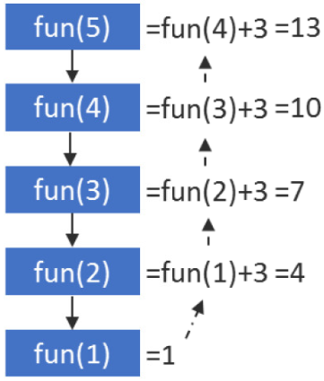
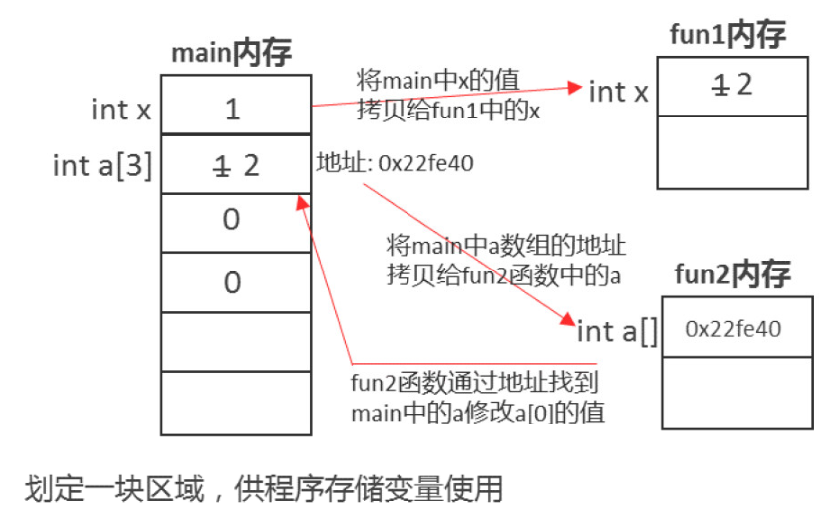
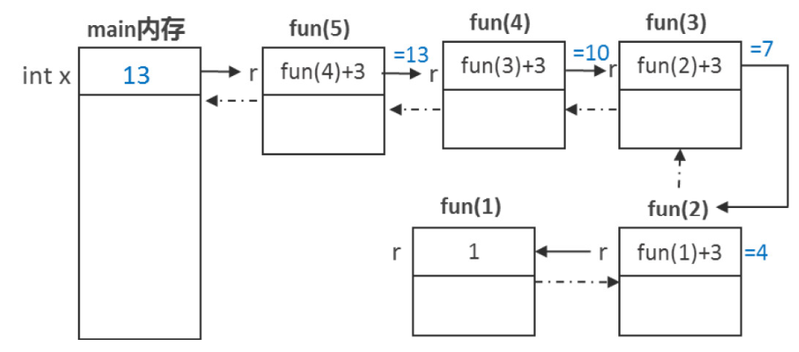
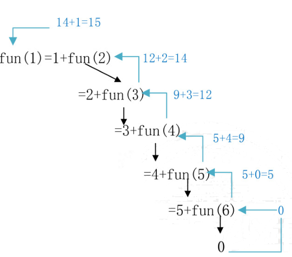
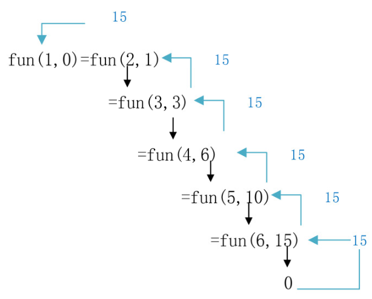

# 第6章递归算法
## 6.1递归基础
### 一、什么是递归?

递归:函数的自我调用;
数列递归:如果一个数列的项与项之间存在关联性，那么可以使用递归实现;
原理:如果一个函数可以求A(n)，那么该函数就可以求A(n-1)，就形成了递归调用;
注意:一般起始项是不需要求解的，是已知条件;

递归求解问题的过程:
第一步:找出规律
第二步:函数调用自己求解前面的项
第三步:交代起始项，让递归能够停止

递归重要思想:

* 既然函数fun()能够求第n项，那么它就能求第n-1项，也能求第n+1项;
* 既然函数fun()能够解决一个问题的第n步，就能解决第n-1步，也能解决第n+1步;

递归算法解决问题的特点:
(1)递归就是在过程或函数里调用自身。
(2)在使用递归策略时，**必须有一个明确的递归结束条件**，称为递归出口。
(3)递归算法解题通常显得很简洁，但递归算法解题的运行效率较低。所以一般不提倡
用递归算法设计程序。
(4)在递归调用的过程当中系统为每一层的返回点、局部量等开辟了栈来存储。递归次
数过多容易造成栈溢出等。
**由于递归的求解效率较低，且比较消耗内存，因此如果递归能够转化为循环，尽量用循环！**


### 二、递归案例
例子:定义函数，递归求解等差数列1 4 7 10 13....第n项的值
递归规律:A(n)=A(n-1)+3

```CPP
#include <bits/stdc++.h>
using namespace std;
//求首项为1，差值为3的等差数列的第n项
// A(n)=A(n-1)+3 
int fun(int n) {
  int r = 0;
  //递归一定要记得去交代递归的停止条件
  //让递归能够停下来
  if (n == 1) {
    r = 1;
  } else {
    r = fun(n - 1) + 3;
  }
  return r;
}
int main() {
  for (int i = 1; i <= 10; i++) {
    cout << fun(i) << endl;
  }
}
```




### 三、值传递和地址传递的区别
地址:变量在内存中的编号;
比如，数组的本质是a[0]的地址!
指针地址在C++中叫做指针!

```CPP
#include <bits/stdc++.h>
using namespace std;
void fun1(int x) { x++; }
void fun2(int a[]) { a[0]++; }
int main() {
  int x = 1;
  fun1(x);
  cout << x << endl;
  int a[3] = {0};
  a[0] = 1;
  cout << a << endl;
  fun2(a);
  cout << a[0] << endl;
  /*
  //以0x开头表示16进制
  int y=0x1A;
  cout<<y<<endl;
  //以0开头表示8进制
  int z=017;
  cout<<z<<endl;
*/
}
```




注意：
**原理：**

1. 每个函数**运行时会生成一个独立的内存**， 来存储函数内部定义的变量， 因此函数互相看不到对方内部定义的变量名， 也不会出现变量名冲突的情况。
1. 向函数中传递整数， 本质是将整数的值拷贝给函数； 向函数中传递数组，本质是将数组的地址拷贝给函数；
上述程序中，将main 函数中的x拷贝给 fun1 函数的x， 实际上**拷贝的是main函数中x的值**；将main 函数中a拷贝给 fun2 函数中的a， 实际上**拷贝的是a的地址**；
结论：main函数中的x和 fun 函数中的x不是一个x，但main 函数中的 a 和fun函数中的a是一个a(地址)。
关键问题**看传递给函数的是一个整数值还是一个数组的地址**！


等差数列递归过程中的内存储存!




### 6.2递归习题
要点:学会将循环问题改造成递归问题，并深入理解递归的执行过程!
一、数值类问题递归

#### 1002:[入门]编程求解1+2+3+...+n

解法一:使用公共变量，将每次递归产生的变量i，加到总和上!

```CPP
#include <bits/stdc++.h>
using namespace std;
int n;
int s;  // s默认初始值0
//递归数出1~n之间所有的数
void fun(int i) {
  if (i <= n) {
    // cout<<i<<endl;
    s += i;
    fun(i + 1);
  }
}
int main() {
  cin >> n;
  fun(1);
  cout << s;
}
```


思想:通过递归数数，fun(int)函数是为了输出i的值，既然fun(int)可以输出i的值，就能输出i+1的值，也能输出i+2的值，也就是能输出1~n的每个数的值!

1、首先通过本问题让同学们理解递归的本质(函数自我调用),并从递归的功能角度先理解
递归的作用(**递归能解决第n项的问题，就能解决第n+1项的问题，也能解决第n-1项的问**
**题**)。本题中fun(int)函数的作用，是为了递归产生1~n中的每个数，换言之，既然函数能
cout<<1，就能cout<<2，就能cout<<n，这就是递归!

2、能够通过fun(int)打印出1~n的每一项，求和就很简单了。

3、**理解局部变量和全局变量在递归中的区别**，全局变量s和n在递归中，值是共享的，而
局部变量(比如: i), 是归每个函数独享的。*需注意，如果是值不能共享的变量，在递归中，*
*千万不要定义为公共的*。

解法二:通过层层累加，然后将和层层返回，求和!

```CPP
#include <bits/stdc++.h>
using namespace std;
int n;  //表示求和范围
//有返回值，通过层层累加，将和返回
int fun(int i) {
  if (i <= n) {
    return i + fun(i + 1);
  } else {
    return 0;
  }
}
int main() {
  cin >> n;
  //从1开始递归
  cout << fun(1);
}
```

重点:
思想: fun(1~n 的和)= 1+fun(2 ~ n)的和，因此fun(int)函数的且的是为了求1~n 之间所有数的
1、理解如何通过递归将值层层返回的过程。
2、本题的理解可以结合下方的图形，如下图所示，求1~5之间所有数的和，也就是fun(1)
表示从1开始求和。
fun(1)=1+fun(2)=1+2+fun(3)=1+2+3+fun(4)=1+2+3+4+fun(5)=1+2+3+4+5+fun(6),由于6>n(假设n为5),因此递归停止， 返回0，那么fun(1)=1+2+3+4+5+0=15。 在递归图中，先通过黑色的线层层递归，再通过蓝色的线层层返回得到最终结果。




解法三:通过输入参数，层层累加求和!


```CPP
#include <bits/stdc++.h>
using namespace std;
int n;  //表示求和范围
//有返回值，通过输入参数，层层累加，最后返回这个求和的输入参数
int fun(int i, int s) {
  if (i <= n) {
    return fun(i + 1, s + i);
  } else {
    return s;
  }
}

int main() {
  cin >> n;
  //从1开始递归，初始的和为0
  cout << fun(1, 0);
}
```

重点:*通过fun(int)函数递归出1~n的每个数，每遇到一个数，就加到s上，然后层层递归*
*深入，当递归结束，再层层返回求出的和s的值。*
1、理接通过输入参数累加求和的过程;
2、如下图所示，每一层在递归下一层时，都会把这一层得到的i加到总和s上去，并将s的
值带到下一层，直到递归结束，s就是总和，此时，再层层返回s，就能得到总和。
3、和上一个解法不同，上一个解法每一层得到的和并未带到下一层，而是再等待下一层的
返回，*再返回时计算总和*; 而本解法，是每一层都将和计算出来带入下一层继续计算，到递
归结束，其实已经有和，只需要层层返回即可。




说明:本题我们采用了三种做法来解决本题，三种解法在后续的递归深入(深搜)类问题中
都有应用，因此请大家在教学中让同学们都掌握一下。
不过，在讲解时，可以循序渐进，可以每隔1、2次课讲解1种做法，让同学们可以循序渐
进得掌握熟练一种解法之后，再掌握其他的解法


#### 1241 - 【入门】角谷猜想

解法一通过公共变量累计总次数

```CPP
/*1241 - 【入门】角谷猜想
题目描述
日本一位中学生发现一个奇妙的定理，请角谷教授证明，而教授无能为力，于是产生了角谷猜想。
猜想的内容：任给一个自然数，若为偶数则除以2，若为奇数则乘3加1，
得到一个新的自然数后按上面的法则继续演算。若干次后得到的结果必为1。请编写代码验证该猜想：求经过多少次运算可得到自然数1。
如：输入22，则计算过程为。
22/2=11
11×3+1=34
34/2=17
17×3+1=52
52/2=26
26/2=13
13×3+1=40
40/2=20
20/2=10
10/2=5
5×3+1=16
16/2=8
8/2=4
4/2=2
2/2=1
经过15次运算得到自然数1。

输入
一行，一个正整数n。（1 <= n <= 20000 )

输出
一行，一个整数，表示得到1所用的运算次数。

样例
输入
22
输出
15
来源
需要找规律的循环

标签
需要找规律的循环
*/
#include <bits/stdc++.h>
using namespace std;
int c;  //公共变量累计递归次数
void fun(int n) {
  if (n != 1) {
    if (n % 2 == 0) {
      fun(n / 2);
    } else {
      fun(n * 3 + 1);
    }
    //每次递归，公共变量自增1
    c++;
  }
}
int main() {
  int n;
  cin >> n;
  fun(n);
  cout << c;
}
```

解法二:累计计算递归次数，然后层层返回

```CPP
#include <bits/stdc++.h>
using namespace std;
int fun(int n) {
  if (n != 1) {
    if (n % 2 == 0) {
      return 1 + fun(n / 2);
    } else {
      return 1 + fun(n * 3 + 1);
    }
  } else {
    return 0;
  }
}
int main() {
  int n;
  cin >> n;
  cout << fun(n);
}
```


解法三:通过输入参数逐层+1，最后返回c的值


```CPP
#include <bits/stdc++.h>
using namespace std;
//递归按照规则计算整数n，直到n为1
int fun(int n, int c) {
  //如果n!=1，则递归
  if (n != 1) {
    if (n % 2 == 0) {
      return fun(n / 2, 1 + c);
    } else {
      return fun(n * 3 + 1, 1 + c);
    }
  } else {
    return c;
  }
}
int main() {
  int n;
  cin >> n;
  cout << fun(n, 0);
}
```


#### 1108:【入门】正整数N转换成一个二进制数

解法一:利用公共变量累加


```CPP
#include <bits/stdc++.h>
using namespace std;
string s;
//递归将n除2
void fun(int n) {
  char c;
  //递归条件:n!=0
  if (n != 0) {
    c = n % 2 + '0';
    s = c + s;
    fun(n / 2);
  }
}
int main() {
  int n;
  cin >> n;
  fun(n);
  if (n == 0)
    cout << 0;
  else
    cout << s;
}
```


解法二:通过层层累加计算结果，层层返回

```CPP
#include <bits/stdc++.h>
using namespace std;
//递归将n除2
string fun(int n) {
  char c;
  //递归条件:n!=0
  if (n != 0) {
    c = n % 2 + '0';
    return fun(n / 2) + c;
  } else {
    return "";
  }
}
int main() {
  int n;
  cin >> n;
  if (n == 0)
    cout << 0;
  else
    cout << fun(n);
}
```

解法三:利用输入参数逐层累加结果，在最后一层返回.

```CPP
#include <bits/stdc++.h>
using namespace std;
//递归将n除2
string fun(int n, string r) {
  char c;
  //递归条件: n!=0
  if (n != 0) {
    c = n % 2 + '0';
    return fun(n / 2, c + r);
  } else {
    return r;
  }
}
int main() {
  int n;
  cin >> n;
  if (n == 0)
    cout << 0;
  else
    cout << fun(n, "");
}
```


#### **1088 - 【入门】求两个数M和N的最大公约数**

```CPP
/*1088 - 【入门】求两个数M和N的最大公约数
题目描述
求两个正整整数 MM 和 NN 的最大公约数(MM，NN都在长整型范围内）（5.1.42）

输入
输入一行，包括两个正整数。
输出
输出只有一行，包括1个正整数。

样例
输入
45 60
输出
15
来源
需要找规律的循环
标签
需要找规律的循环
*/
#include <bits/stdc++.h>
using namespace std;
//递归:将辗转相除法，重复用递归求解
long long fun(long long a, long long b) {
  //递归停止条件:a%b==0
  if (a % b != 0) {
    return fun(b, a % b);
  } else {
    return b;
  }
}
int main() {
  long long a, b, t;
  cin >> a >> b;
  cout << fun(a, b);
}
```

### 二、数值类递归作业
#### 1083:[基础]回文数
#### 1084:[入门]因子求和
#### 1244:[入门]请问一个正整数能够整除几次2?
#### 1307:[基础]数的计数

#### 1087:[入门]两个自然数M和N的最小公倍数


### 三、应用类问题递归

#### 1223 - 【入门】汉诺塔的移动次数

A为存放盘子的塔，C为目标塔，B为辅助塔
算法分为三步
一、将A上n-1个盘子全部放到B塔上，借助于C
二、将A上剩下的一个盘子放到C塔上
三、将B塔上n-1个盘子全部放到C塔上，借助于A
注:不需要考虑如何移动n-1个盘子

```CPP
/*1223 - 【入门】汉诺塔的移动次数
题目描述
汉诺塔的问题大家都已经很熟悉了，有三个柱子，每个柱子上有一些大小不一的金片，要把金片从A柱移动到C柱，可以借助B柱，请问n个金片的情况下，需要最少移动多少次？

输入
输入一个整数n代表金片的数量（n<=20）
输出
一个整数，代表n个金片的移动次数

样例
输入
3
输出
7
来源
递归

标签
递归
*/
#include <bits/stdc++.h>
using namespace std;
//递归求解n个金片的移动步数
int fun(int n) {
  //递归的出口
  if (n == 1) {
    return 1;
  } else {
    return fun(n - 1) * 2 + 1;
  }
}
int main() {
  /*
  移动的过程：
  1.先将n-1个金片 (n个金片除了最下面一个以外的金片)从A位置，借助C位置，
  移动到B位置，需要fun(n-1)步 2.将A位置的最下方的一个金片，
  直接移动到C位置，需要1步 3.将B位置的n-1个金片，
  从B位置借助A位置移动到C位置需要fun(n-1)步
  因此得到结论如下:fun(n)=fun(n-1)*2+1
  */
  int n;
  cin >> n;
  cout << fun(n);
}
```

#### 1222:【基础】经典递归问题–汉诺塔

A 为存放盘子的塔，C 为目标塔， B为辅助塔
算法分为三步
一、将A 上 n-1 个盘子全部放到 B 塔上， 借助于 C
二、将A上剩下的一个盘子放到C塔上
三、将B塔上n-1个盘子全部放到 C 塔上， 借助于A
注：不需要考虑如何移动n-1 个盘子

```CPP
/*1222 - 【基础】经典递归问题——汉诺塔
题目描述
汉诺塔（又称河内塔）问题是印度的一个古老的传说。开天辟地的神勃拉玛在一个庙里留下了三根金刚石的棒，第一根上面套着64个圆的金片，最大的一个在底下，其余一个比一个小，依次叠上去，庙里的众僧不倦地把它们一个个地从这根棒搬到另一根棒上，规定可利用中间的一根棒作为帮助，但每次只能搬一个，而且大的不能放在小的上面。面对庞大的数字(移动圆片的次数)18446744073709551615，看来，众僧们耗尽毕生精力也不可能完成金片的移动。

后来，这个传说就演变为汉诺塔游戏:
1.有三根杆子A,B,C。A杆上有若干碟子
2.每次移动一块碟子,小的只能叠在大的上面
3.把所有碟子从A杆全部移到C杆上
经过研究发现，汉诺塔的破解很简单，就是按照移动规则向一个方向移动金片：
如3阶汉诺塔的移动：A→C,A→B,C→B,A→C,B→A,B→C,A→C
　　此外，汉诺塔问题也是程序设计中的经典递归问题。
算法思路： 1.如果只有一个金片，则把该金片从源移动到目标棒，结束。
2.如果有n个金片，则把前n-1个金片移动到辅助的棒，然后把自己移动到目标棒，最后再把前n-1个移动到目标棒。

输入
一个整数N，表示A柱上有N个碟子。（0<n<=10）

输出
若干行，即移动的最少步骤

样例
输入
3
输出
A To C
A To B
C To B
A To C
B To A
B To C
A To C
来源
递归

标签
递归
*/
#include <bits/stdc++.h>
using namespace std;
/*
移动的过程：
1、先将n-1 个金片(n 个金片除了最下面一个以外的金片)
从A位置，借助C位置，移动到B位置， 需要fun(n-1)步
2、将A位置的最下方的一个金片， 直接移动到C位置，需要1步
3、将 B 位置的 n-1 个金片， 从B位置借助A位置移动到C位置
需要 fun(n-1)步
因此得到结论如下：fun(n)= fun(n-1) * 2+1
*|
|*
函数的作用：将n个金片从 p1 位置， 借助 p2 位置，移动到 p3 位置
p1:源位置（金片所在的源位置）
p2:辅助位置（移动的过程中要借助的位置）
p3 : 目标位置（移动到的位置）
*/
void move(int n, char p1, char p2, char p3) {
  //递归的出口：只要有金片就要递归， 没有金片递归停止
  if (n > 0) {
    //第 1 步：将n-1个金片，从p1位置， 借助 p3 位置，移动到 p2 位置
    move(n - 1, p1, p3, p2);
    //第 2 步： 将p1位置的第n个金片直接移动到 p3位置
    cout << p1 << " To " << p3 << endl;
    //第 3 步：将 p2 位置的 n-1 个金片， 借助于 p1 位置，移动到 p3 位置
    move(n - 1, p2, p1, p3);
  }
}
int main() {
  int n;
  cin >> n;
  //递归调用，打印移动的步骤
  move(n, 'A', 'B', 'C');
  return 0;
}
```

注意：该问题需要从3个层面来理解
(1)从递归的层面， 从大的面的角度直接理解如何搬
(2)
从画递归执行过程图的层面， 理解递归的本质；


(3)从代码运行的层面， 采用单步调试理解递归的过程，为什么 cout<<a<<"To "<<c<<endl;
能够输出不同的结果；


#### 1196 - 【入门】拐角I

```CPP
/*1196 - 【入门】拐角I
题目描述
输入整数N，输出相应方阵。

输入
一个整数N。（ 0 < n < 10 )

输出
一个方阵，每个数字的场宽为3。

样例
输入
5
输出
  1  1  1  1  1
  1  2  2  2  2
  1  2  3  3  3
  1  2  3  4  4
  1  2  3  4  5
来源
二维数组

标签
二维数组
*/

#include <bits/stdc++.h>
using namespace std;
int a[20][20];
int n;
//递归为二维数组的第 i 行和第 i 列赋值
void fun(int i) {
  //递归的出口（递归条件）
  if (i <= n) {
    //第 i 行从下标为 i 的那一列开始赋值
    for (int j = i; j <= n; j++) {
      //为第 i 行赋值
      //为第i列赋值
      a[j][i] = i;
      a[i][j] = i;
    }
    //递归为下一行赋值
    fun(i + 1);
  }
}
int main() {
  cin >> n;
  //从第1行、第 1 列开始递归为二维数组赋值
  fun(1);
  int i, j;
  for (i = 1; i <= n; i++) {
    for (j = 1; j <= n; j++) {
      cout << setw(3) << a[i][j];
    }
    cout << endl;
  }
}
```


#### 1208:【基础】螺旋方阵


```CPP
/*1208 - 【基础】螺旋方阵
题目描述
螺旋方阵

输入
一个整数n(０＜ｎ＜10)

输出
一个n行方阵，每行n个数，每个数场宽为3

样例
输入
5
输出
  1  2  3  4  5
 16 17 18 19  6
 15 24 25 20  7
 14 23 22 21  8
 13 12 11 10  9
来源
二维数组

标签
二维数组
*/
#include <bits/stdc++.h>
using namespace std;
int a[20][20], n;
//为二维数组的第x圈赋值
// start: 起始点的坐标
// len:赋值的宽度
// x:起始值
void fun(int start, int len, int x) {
  //递归出口
  if (len > 0) {
    int i, j;
    //循环第1行的列（向右）
    for (j = start; j <= start + len - 1; j++) {
      a[start][j] = x;
      x++;
    }
    //循环向下，最后一列，循环行
    for (i = start + 1; i <= start + len - 1; i++) {
      a[i][start + len - 1] = x;
      x++;
    }
    //循环向左，最后一行，循环列
    for (j = start + len - 2; j >= start; j--) {
      a[start + len - 1][j] = x;
      x++;
    }
    //循环向上，第 1 列，循环行
    for (i = start + len - 2; i >= start + 1; i--) {
      a[i][start] = x;
      x++;
    }
    //递归为 start+1 这一圈赋值
    fun(start + 1, len - 2, x);
  }
}

int main() {
  cin >> n;
  //为从1,1点开始的一圈赋值， 初始值赋1
  fun(1, n, 1);
  //输出
  int i, j;
  for (i = 1; i <= n; i++) {
    for (j = 1; j <= n; j++) {
      cout << setw(3) << a[i][j];
    }
    cout << endl;
  }
}
```


### 四、应用类递归作业
#### 1193:【入门】斜角II

#### 1209:【基础】回形方阵

