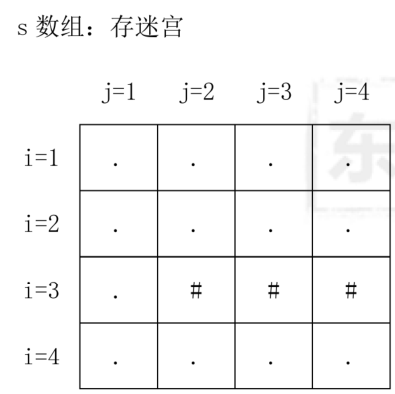
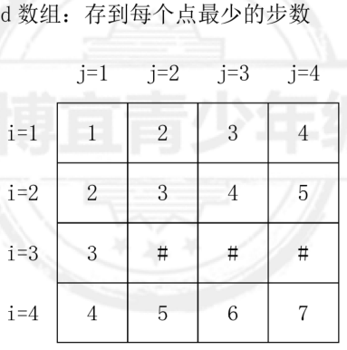
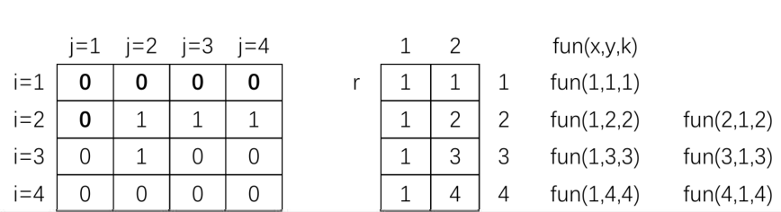
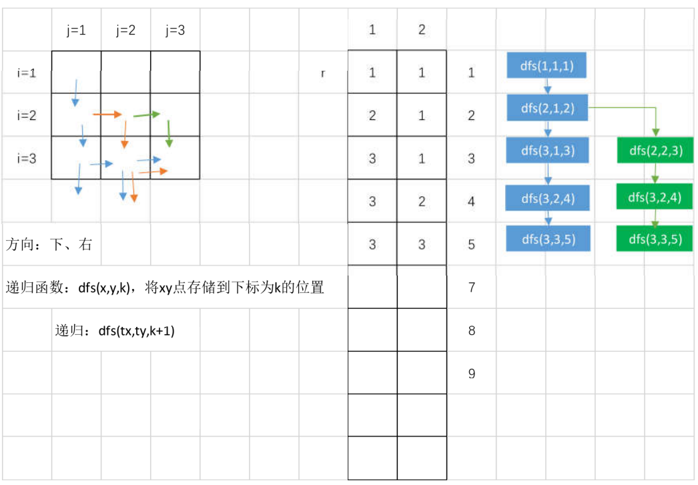

## 7.2深搜进阶
### 一、最少步数问题
1432:【基础】走出迷宫的最少步数





思路：如果走到某个点 x, y, 需要的步数，比 d 数组中记录的最少步数还少， 则走该点 d 数组的初始值设置为 INT_MAX, 递归函数设计：dfs(x, y, k)，在递归时：dfs(tx, ty, k+1)

思路：
1、准备一个整数数组， 记录从出发点到每个点至少需要多少步，初始化为INT_MAX;
2、从出发点开始探测，顺时针探测， 如果该点可达，且到该点的步数更少， 则替换d数组的步数；
3、最终d 数组记录了到每个点至少需要多少步， a[n] [m]就是最终结果；**递归的重点是如何防止死循环！！!**

```CPP
/*1432 - 【基础】走出迷宫的最少步数
题目描述
一个迷宫由R行C列格子组成，有的格子里有障碍物，不能走；有的格子是空地，可以走。
给定一个迷宫，求从左上角走到右下角最少需要走多少步(数据保证一定能走到)。只能在水平方向或垂直方向走，不能斜着走。

输入
第一行是两个整数，R和C，代表迷宫的行数和列数。（ 1<= R，C <= 40)
接下来是R行，每行C个字符，代表整个迷宫。空地格子用'.'表示，有障碍物的格子用'#'表示。迷宫左上角和右下角都是'.'。

输出
输出从左上角走到右下角至少要经过多少步（即至少要经过多少个空地格子）。计算步数要包括起点和终点。

样例
输入
5 5
..###
#....
#.#.#
#.#.#
#.#..
输出
9
来源
深搜 递归 广搜

标签
深搜递归广搜
*/
#include <bits/stdc++.h>
using namespace std;
int n, m;
char a[50][50];  //地图
int d[50][50];   //存储走到每个点最少需要多少步
//方向值变化的数组
int fx[5] = {0, 0, 1, 0, -1};
int fy[5] = {0, 1, 0, -1, 0};
//递归探索地图， 求到走到每个点最少需要多少步
void dfs(int x, int y, int dep) {
  d[x][y] = dep;
  int tx, ty;
  //循环数组，得到 4 个新的方向， 递归探索 4 个方向
  for (int i = 1; i <= 4; i++) {
    tx = x + fx[i];
    ty = y + fy[i];
    //如果 tx,ty 可以探索(该点在地图内， 且该点是。，且走到该点的步数更少)
    if (a[tx][ty] == '.' && dep + 1 < d[tx][ty]) {
      dfs(tx, ty, dep + 1);
    }
  }
}
int main() {
  int i, j;
  cin >> n >> m;
  for (i = 1; i <= n; i++) {
    for (j = 1; j <= m; j++) {
      cin >> a[i][j];
      //将最少步数初始值设为 INT_MAX
      d[i][j] = INT_MAX;
    }
  }
  //调用函数
  dfs(1, 1, 1);
  cout << d[n][m];
}
```


二、第一条路径问题
1431:【基础】迷宫的第一条出路




```CPP
/*1431 - 【基础】迷宫的第一条出路
题目描述
已知一N×N的迷宫，允许往上、下、左、右四个方向行走，现请你按照左、上、右、下顺序进行搜索，找出第一条从左上角到右下角的路径。

输入
输入数据有若干行，第一行有一个自然数N（N≤20），表示迷宫的大小，其后有N行数据，每行有N个0或1（数字之间没有空格，0表示可以通过，1表示不能通过），用以描述迷宫地图。入口在左上角（1，1）处，出口在右下角（N，N）处。所有迷宫保证存在从入口到出口的可行路径。

输出
输出数据仅一行，为按照要求的搜索顺序找到的从入口到出口的第一条路径（搜索顺序：左、上、右、下）。

样例
输入
4
0001
0100
0010
0110
输出
(1,1)->(1,2)->(1,3)->(2,3)->(2,4)->(3,4)->(4,4)
来源
深搜 递归

标签
深搜递归
*/
#include <bits/stdc++.h>
using namespace std;
//左、上、右、下顺序进行搜索
char a[30][30];
int r[410][3];  //记录正确的第一条路径
int n;
//方向的变化
int fx[5] = {0, 0, -1, 0, 1};
int fy[5] = {0, -1, 0, 1, 0};
//打印 r 数组中存储的第一条路线
void print(int k) {
  for (int i = 1; i <= k; i++) {
    cout << "(" << r[i][1] << "," << r[i][2] << ")";
    //如果不是最后一个点，打印连接的->
    if (i != k) {
      cout << "-> ";
    }
  }
  exit(0);  //停止程序
}
//向路径数组下标为k 的位置， 记录一个坐标x,y
void dfs(int x, int y, int k) {
  //记录探索到的点的坐标
  r[k][1] = x;
  r[k][2] = y;
  //将走过的点，标记为 1，防止死循环
  a[x][y] = '1';
  //判断 xy 如果是终点，则打印路径
  if (x == n && y == n) {
    print(k);
  }
  int tx, ty;
  //探索四个方向
  for (int i = 1; i <= 4; i++) {
    tx = x + fx[i];
    ty = y + fy[i];
    //如果该点可达(没走过，且不是障碍， 且没有出迷宫)
    if (a[tx][ty] == '0') {
      //向 r 数组的下标为 k+1 那一行， 记录tx,ty点
      dfs(tx, ty, k + 1);
    }
  }
}
int main() {
  int i, j;
  cin >> n;
  for (i = 1; i <= n; i++) {
    for (j = 1; j <= n; j++) {
      cin >> a[i][j];
    }
  }
  //调用函数，探索出第一条路径
  //向r数组的下标为 1 的那一行， 记录1,1点
  dfs(1, 1, 1);
}
```


### 三、所有路径问题
1360【基础】卒的遍历




*解法一：参照迷宫的第一条路， 深搜出迷宫的所有路径*

```CPP
/*1360 - 【基础】卒的遍历
题目描述
在一张n*m的棋盘上（如6行7列）的最左上角（1,1）的位置有一个卒。
该卒只能向下或者向右走，且卒采取的策略是先向下，下边走到头就向右，
请问从（1,1）点走到（n,m）点可以怎样走，输出这些走法。

输入
两个整数n，m代表棋盘大小（3≤n≤8,3≤m≤8）

输出
卒的行走路线

样例
输入
3 3
输出
1:1,1->2,1->3,1->3,2->3,3
2:1,1->2,1->2,2->3,2->3,3
3:1,1->2,1->2,2->2,3->3,3
4:1,1->1,2->2,2->3,2->3,3
5:1,1->1,2->2,2->2,3->3,3
6:1,1->1,2->1,3->2,3->3,3
来源
深搜 递归

标签
深搜递归
*/
//解法一：参照迷宫的第一条路， 深搜出迷宫的所有路径
#include <bits/stdc++.h>
using namespace std;
//只能向下或者向右走：优先向下， 其次向右
int n, m;
int r[20][3];  //存储行走路径
//方向的变化
int fx[3] = {0, 1, 0};
int fy[3] = {0, 0, 1};
int c;  //计数器
void print(int k) {
  c++;
  cout << c << ":";
  //除了最后一个点以外
  for (int i = 1; i < k; i++) {
    cout << r[i][1] << "," << r[i][2] << "->";
  }
  cout << n << "," << m << endl;
}
//向 r 数组下标为 k 的那一行，记录x,y 点
void dfs(int x, int y, int k) {
  //记录坐标
  r[k][1] = x;
  r[k][2] = y;
  //如果走到了终点，打印路径
  if (x == n && y == m) {
    print(k);
    //停止递归函数，到了终点打印， 就不需要继续递归了
    return;
  }
  int tx, ty;
  for (int i = 1; i <= 2; i++) {
    tx = x + fx[i];
    ty = y + fy[i];
    //判断 tx,ty 有效
    if (tx >= 1 && tx <= n && ty >= 1 && ty <= m) {
      dfs(tx, ty, k + 1);
    }
  }
}
int main() {
  cin >> n >> m;
  //向 r 数组下标为 1 的那一行， 记录1,1点
  dfs(1, 1, 1);
}
```

### 四、深搜作业
1433:【基础】走出迷宫的最少步数 2
1362:【提高】马的遍历
1438:【基础】骑士巡游
1380:【提高】小X学游泳
1541:【提高】小X学游泳(swim)
1440:【提高】卫星照片
