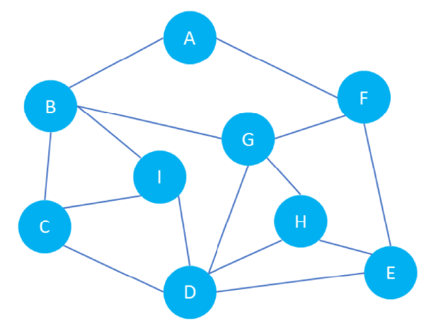
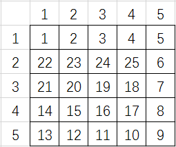
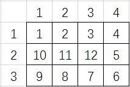
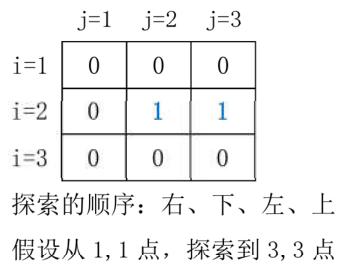
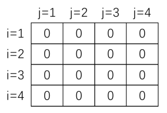

# 第7章 深搜与回溯

## 7.1 深搜基础
### 一、什么是深搜

深度优先搜索属于图算法的一种， 英文缩写为 DFS 即 Depth First Search。其过程是
*对每一个可能的分支路径深入到不能再深入为止 ，而且每个节点只能访问一次*。
简单来说就是：***一路走到头，不撞墙不回头***。
案例：图的遍历




遍历如左图所示的图， 图中部分结点之间有路径连接。 遍历规则为：深度优先，右手路
径优先，不能重复遍历。 请问遍历的结果是什么？
遍历结果：ABCDEFGHI

### 二、深搜入门案例

#### 1586:【入门】扫地机器人





```CPP
/*1586 - 【入门】扫地机器人
题目描述
Mike同学在为扫地机器人设计一个在矩形区域中行走的算法，Mike是这样设计的：先把机器人放在出发点(1,1)点上，机器人在每个点上都会沿用如下的规则来判断下一个该去的点是哪里。规则：优先向右，如果向右不能走（比如：右侧出了矩形或者右侧扫过了）则尝试向下，向下不能走则尝试向左，向左不能走则尝试向上；直到所有的点都扫过。

Mike为了验证自己设计的算法是否正确，打算先模拟一下这个算法，每当机器人走过一个单元格时，会在单元格内标记一个数字，这个数字从1开始，每经过一个单元格数字会递增1，直到所有的单元格都扫一遍，也就是所有的单元格都标记过数字，机器人会自动停止。
比如：如果机器人按照上面的规则，清扫一个3 * 4大小的矩形区域，那么标记数字的结果如下图所示。


再比如：如果机器人按照上面的规则，清扫一个5 * 5大小的矩形区域，那么标记数字的结果如下图所示。

请你帮助Mike设计一个程序，按照上面的规则，将一个n * m大小的矩形，标记一下数字，输出最终标记的结果。

输入
一行内有2个两个整数n和m，用空格隔开，分别代表矩形区域的行数（高）和列数（宽）（n和m都是2~9之间的整数）

输出
输出按题意机器人走过每个点之后，标记数字的结果，每个数字输出时场宽设置为3。

样例
输入
3 4
输出
  1  2  3  4
 10 11 12  5
  9  8  7  6
来源
深搜

标签
深搜
*/

```

解题思路：
本题要求为矩阵每个点赋值， 可以定义函数，来为矩阵赋值，
比如：定义函数 fun(int x, int y, int k)，含义是为 x、y点赋值为k.
调用函数时，首先为 1, 1 点赋值为 1, 也就是 fun(1, 1, 1),
既然函数能够为1,1 点赋值，也就能为 1, 2 点赋值，以此类推， 是典型的递归思想，要注意，每次递归， 所赋的值要+1.
本题需要掌握下列内容：
1、理解赋值的顺序，任意给定一个 n* m 的矩阵，能够写出赋值的结果；
2、理解递归的过程， 任意给定一个 n* m 的矩阵， 能够画出递归的过程；
3、理解程序编写的过程，和实现的原理；
4、理解函数递归调用的过程；
5、理解迷宫类递归的几种不同写法；
解法一：从出发点开始，探测每个点， 标记数字，标记结束后，分别递归四个方向，
如果探测的点满足要求，则访问该点！

```CPP
#include <bits/stdc++.h>
using namespace std;
int n, m;
int a[20][20];
//为二维数组赋值
//为 x,y 点赋值为 k
void fun(int x, int y, int k) {
  a[x][y] = k;  //赋值
  //优先向右，其次向下，再次向左， 再次向上
  //递归的条件：不能出边界， 且不能访问已经赋值的点
  if (y + 1 <= m && a[x][y + 1] == 0) fun(x, y + 1, k + 1);
  //向下尝试
  if (x + 1 <= n && a[x + 1][y] == 0) fun(x + 1, y, k + 1);
  //向左尝试
  if (y - 1 >= 1 && a[x][y - 1] == 0) fun(x, y - 1, k + 1);
  //向上尝试
  if (x - 1 >= 1 && a[x - 1][y] == 0) fun(x - 1, y, k + 1);
}
int main() {
  // n行m列
  cin >> n >> m;
  //为 1,1 点赋值为 1
  fun(1, 1, 1);
  //输出
  int i, j;
  for (i = 1; i <= n; i++) {
    for (j = 1; j <= m; j++) {
      cout << setw(3) << a[i][j];
    }
    cout << endl;
  }
}
```


解法二：从出发点开始，探测每个点， 标记数字，标记结束后，分别递归四个方向， 不
管探测点是否可行，直接递归访问， 在递归一进来的地方判断递归点是否可访问 !

```CPP
#include <bits/stdc++.h>
using namespace std;
int n, m;
int a[20][20];
//为二维数组赋值
//为x,y点赋值为k
void fun(int x, int y, int k) {
  //由于每 次递归前没有检验递归的点是有效点
  //因此可能xy 是无效的(出了边界的点， 或者已经赋值的点)
  if (x >= 1 && x <= n && y >= 1 && y <= m && a[x][y] == 0) {
    a[x][y] = k;  //赋值
    //优先向右，其次向下，再次向左，再次向上
    //向右尝试
    fun(x, y + 1, k + 1);
    //向下尝试
    fun(x + 1, y, k + 1);
    //向左尝试
    fun(x, y - 1, k + 1);
    //向上尝试
    fun(x - 1, y, k + 1);
  }
}
int main() {
  // n行m列
  cin >> n >> m;
  //为 1,1 点赋值为 1
  fun(1, 1, 1);
  //输出
  int i, j;
  for (i = 1; i <= n; i++) {
    for (j = 1; j <= m; j++) {
      cout << setw(3) << a[i][j];
    }
    cout << endl;
  }
}
```


解法三：使用方向数组， 循环递归访问四个方向！ (也可以分为在探测前判断准备探测
点的正确性 以及 不管点是否正确， 直接递归， 在递归进来的地方判断点是否正确两种写
法）

```CPP
#include <bits/stdc++.h>
using namespace std;
int n, m;
int a[20][20];
//定义数组，存储x和y变化的值
int fx[5] = {0, 0, 1, 0, -1};
int fy[5] = {0, 1, 0, -1, 0};
//为二维数组赋值
//为 x,y 点赋值为k
void fun(int x, int y, int k) {
  //由于每次递归前没有检验递归的 点是有效点
  //因此可能 xy 是无效的(出了边界的点， 或者已经赋值的点)
  if (x >= 1 && x <= n && y >= 1 && y <= m && a[x][y] == 0) {
    a[x][y] = k;  //赋值
    //优先向右，其次向下，再次向左， 再次向上
    //通过循环方向值变化的数组，将x和 y 变化的值逐个加到x和y上
    int tx, ty;  //表示将要去的点
    for (int i = 1; i <= 4; i++) {
      tx = x + fx[i];
      ty = y + fy[i];
      //递归
      fun(tx, ty, k + 1);
    }
  }
}
int main() {
  // n 行m 列
  cin >> n >> m;
  //为1,1点赋值为1
  fun(1, 1, 1);
  //输出
  int i, j;
  for (i = 1; i <= n; i++) {
    for (j = 1; j <= m; j++) {
      cout << setw(3) << a[i][j];
    }
    cout << endl;
  }
}
```


注意：上述写法， 可以在在递归之前判断 tx和ty 是否是有效的坐标，修改方法如下。

```CPP
//为二维数组赋值
//为 x,y 点赋值为 k
void fun(int x,int y,int k){
    a[x][y] = k;//赋值
    //优先向右，其次向下，再次向左， 再次向上
    //通过循环方向值变化的数组，将 x 和 y 变化的值逐个加到x和y上
    int tx,ty;//表示将要去的点
    for(int i = 1;i <= 4;i++){
        tx = x + fx[i];
        ty = y + fy[i];
        //递归之前先判断， 保证要访问的点的有效性
        if(tx>=1&&tx<=n&&ty>=1&&ty<=m&&a[tx][ty]==0){
        fun(tx,ty,k+1);
        }
    }
}
```


#### **1430 - 【基础】迷宫出口**

思路：从出发点开始， 探测所有可探测的点， 看是否有目标点，如果有， 就表示可达，否
则表示不可达！



```CPP
/*1430 - 【基础】迷宫出口
题目描述
一天Extense在森林里探险的时候不小心走入了一个迷宫，迷宫可以看成是由n *
n的格点组成， 每个格点只有2种状态，0和1，前者表示可以通行后者表示不能通行。
同时当Extense处在某个格点时，他只能移动到东南西北(或者说上下左右)四个方向之一的相邻格点上，
Extense想要从点A走到点B，问在不走出迷宫的情况下能不能办到。如果起点或者终点有一个不能通行(为1)，则看成无法办到。

输入
第1行是一个正整数n (1 ≤ n ≤ 100)，表示迷宫的规模是n * n的。
接下来是一个n * n的矩阵，矩阵中的元素为0或者1。
再接下来一行是4个整数ha la hb lb，描述A处在第ha行 第la列，B处在第hb行 第lb列。

输出
能办到则输出“YES”，否则输出“NO”。

样例
输入
3
0 1 1
0 0 1
1 0 0
1 1 3 3
输出
YES
来源
深搜 递归 广搜

标签
深搜递归广搜
*/
#include <bits/stdc++.h>
using namespace std;
/*
1.判断如果起止点有1，就不能走；
2.从起点开始搜索，如果走到过终点，标记；
*/
int a[110][110];
int n;
int ha, la, hb, lb;

//搜索所有可行的点，走过标记
void dfs(int x, int y) {
  // cout<<x<<" "<<y<<endl;
  a[x][y] = 1;  //走过的点标记
  //判断是否到达终点
  if (x == hb && y == lb) {
    cout << "YES";
    exit(0);
  }

  //判断四个方向，是否有能走的点，如果有，直接递归执行
  if (y + 1 <= n && a[x][y + 1] == 0) dfs(x, y + 1);
  if (x + 1 <= n && a[x + 1][y] == 0) dfs(x + 1, y);
  if (y - 1 >= 1 && a[x][y - 1] == 0) dfs(x, y - 1);
  if (x - 1 >= 1 && a[x - 1][y] == 0) dfs(x - 1, y);
}

int main() {
  cin >> n;
  for (int i = 1; i <= n; i++) {
    for (int j = 1; j <= n; j++) {
      cin >> a[i][j];
    }
  }
  cin >> ha >> la >> hb >> lb;

  //如果起止点不能走，输出NO
  if (a[ha][la] == 1 || a[hb][lb] == 1) {
    cout << "NO";
    return 0;
  }

  dfs(ha, la);  //从ha,la开始搜索，走过的点标记为1
  cout << "NO";
  return 0;
}

```


#### 1434:【基础】数池塘（四方向）




循环每个点，如果当前的点是‘W’， 则计数器自增 1; 然后从当前的 i, 点开始递归，将
上下左右中相邻的为W的点全部标记为’

```CPP
/*1434 - 【基础】数池塘（四方向）
题目描述
农夫约翰的农场可以表示成N*M（1≤N≤100≤M≤100）个方格组成的矩形。由于近日的降雨，在约翰农场上的不同地方形成了池塘。每一个方格或者有积水（'W'）或者没有积水（'.'）。农夫约翰打算数出他的农场上共形成了多少池塘。一个池塘是一系列相连的有积水的方格，每一个方格周围的四个方格都被认为是与这个方格相连的。现给出约翰农场的图样，要求输出农场上的池塘数。

输入
第1行：由空格隔开的两个整数：N和M
第2..N+1行：每行M个字符代表约翰农场的一排方格的状态。每个字符或者是'W'或者是'.'，字符之间没有空格。

输出
输出只有1行，输出约翰农场上的池塘数

样例
输入
10 12
W........WW.
.WWW.....WWW
....WW...WW.
.........WW.
.........W..
..W......W..
.W.W.....WW.
W.W.W.....W.
.W.W......W.
..W.......W.
输出
13
来源
深搜 递归

标签
深搜递归
*/
#include <bits/stdc++.h>
using namespace std;
/*
思路：当遇到积水格，计数器加 1, 并将该区域的池塘抽干
*/
int n, m;
char a[110][110];  //默认初值为'\0'
int fx[5] = {0, 0, 1, 0, -1};
int fy[5] = {0, 1, 0, -1, 0};
//深搜：将xy及相邻的积水点全部标记为 .
void dfs(int x, int y) {
  //将递归到的有效的点（相邻的有积水的点 标记为。
  a[x][y] = '.';
  int tx, ty;
  //递归尝试4个方向
  for (int i = 1; i <= 4; i++) {
    tx = x + fx[i];
    ty = y + fy[i];
    //如果该点有效(本题判断相邻格是W, 就不用判断是否出边界了)
    if (a[tx][ty] == 'W') {
      dfs(tx, ty);
    }
  }
}
int main() {
  cin >> n >> m;
  int i, j, c = 0;
  //读入地图
  for (i = 1; i <= n; i++) {
    for (j = 1; j <= m; j++) {
      cin >> a[i][j];
    }
  }
  //依次遍历每个点，如果是池塘， 就将计数器+1, 并将相邻池塘单元格全部标记为点
  for (i = 1; i <= n; i++) {
    for (j = 1; j <= m; j++) {
      //如果该点是池塘
      if (a[i][j] == 'W') {
        c++;
        dfs(i, j);
      }
    }
  }
  cout << c;
}
```

### 三、深搜基础作业

1435:【基础】 数池塘（八方向）
1383:【提高】奶牛和草丛