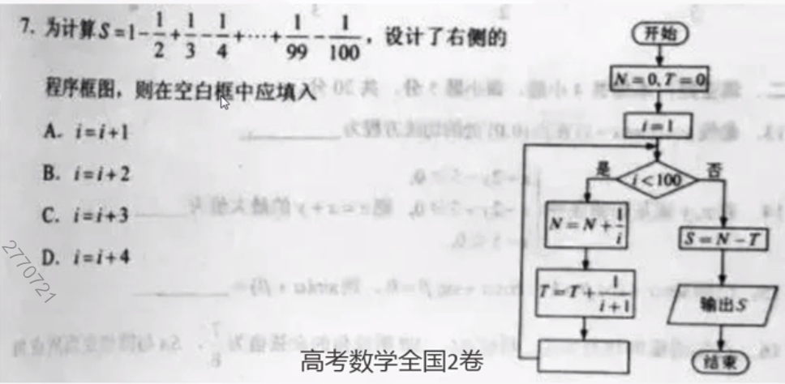
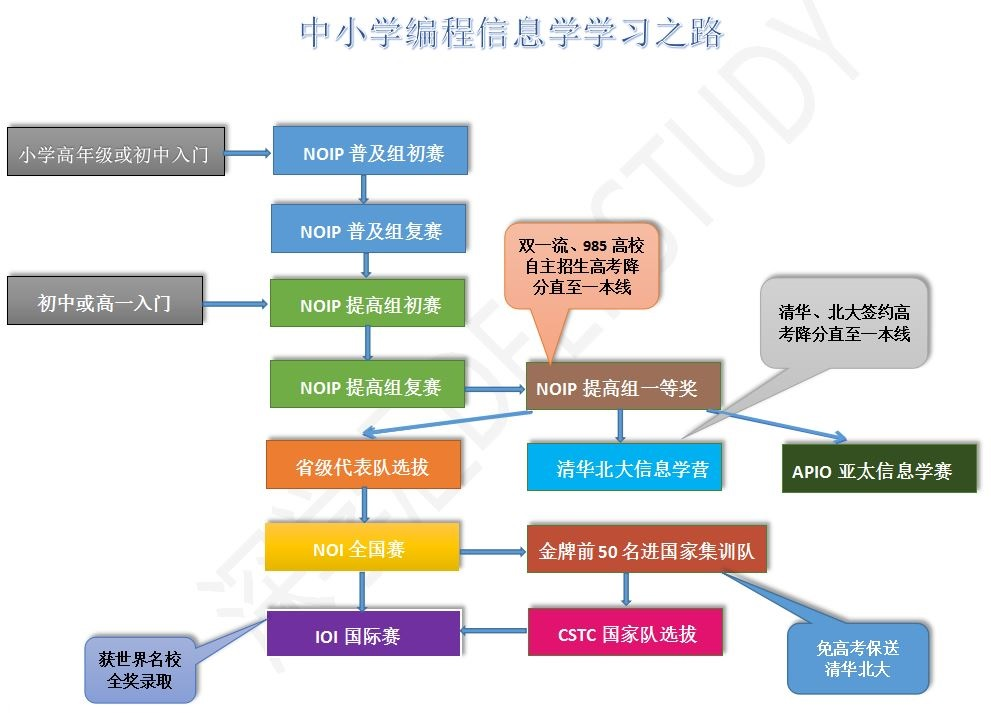

你是否还在将计算机（电脑）当作上网、聊天和玩游戏的工具？没错，大部分人是这样的。

在我们生活的这个时代，你会发现有这样一群人，他们对世界的影响越来越大，电视、报纸和网络到处都充斥着他们的身影。比尔·盖茨创立了微软，让计算机更容易被我们平常人所使用 [1] ；乔布斯创立了苹果，iPhone、iPad和iPod每一样产品都在改变着我们的日常生活；谢尔盖·布林和拉里·佩奇两个年轻的小伙创立了Google，使得获取知识变得前所未有的容易；马克·扎克伯格创立了Facebook，正在改变人与人之间的关系……
他们是怎样的一群人？他们为什么会创造奇迹？巧的是他们都有一个共同的特点：在少年时都酷爱计算机编程。
为什么他们从小就开始接触计算机，不但没有沉迷于游戏，反而改变了世界呢？12岁的托马斯说：“现在的孩子们不再只是爱玩游戏，他们还想自己制作好玩的游戏，不过孩子们大多不知道去哪里学习计算机编程，而懂得计算机编程的家长又很少。”

## 为什么学习青少年编程

国家认可的竞赛项目：
NOP:全国青少年信息学奥林匹克联赛（ NationalOlympiad in Informatics in Provinces)自1995年至2019年已举办25次。每年由中国计算机学会统一组织
高考数学卷出现编程题：2018年高考全国2卷、全国3卷、北京卷、江苏卷出现编程题

享受重点大学降分录取或者自主招生的面试资格:2018年全国青少年信息学奥林匹克莞赛有50名进入国家队集训，并享有保送清华大学，北京大学的资格！
还有多个城市把小升初及初升高列入特长生招生项目

## 学计算机对我们有什么帮助

### 换个角度看世界

从本质上理解软件、游戏等程序
学习计算机编程的过程充满乐趣。如果你有一个想法，马上就可以通过编程来实现，并且可以立即看到效果。这种即时的反馈，会让你的学习兴趣变得越来越浓厚，也会让你越来越有信心。这种超强的信心，是你在其他学科中难以感受到的。

### 锻炼逻辑思维

实践证明，学习了计算机编程的中小学生，思考问题的方式变得非常逻辑化，学会了严密的逻辑推理方法，并无形中把它应用到其他学科的学习中。学习计算机编程本质上是在学习一种思维方式——编程思维，它是一种思维体操。编程有效训练逻辑思维抽象思维能力

### 提升数学应用能力

结合小学、初中的数学知识，提升数学应用能力

### 提升分解、解决问题能力

通过编程解决问题需要学会分解问题并逐步求解
有效提升学生解決问题的能力、耐心、毅力

### 嬴得荣誉提升自信

参赛拿奖，获得荣誉，提升自信

## 怎样学好青少年编程

1. #### 把编程作为兴趣

2. #### 多动手、多思考、多尝试

3. #### 不懂的主动可，懂了的要记住

4. #### 坚持，坚持，坚持

---
