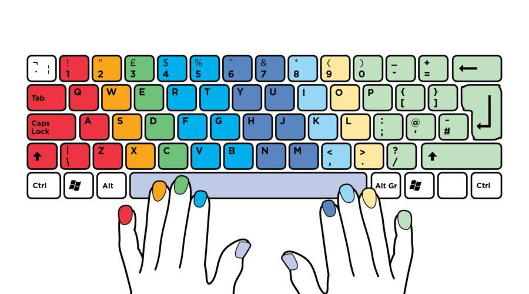
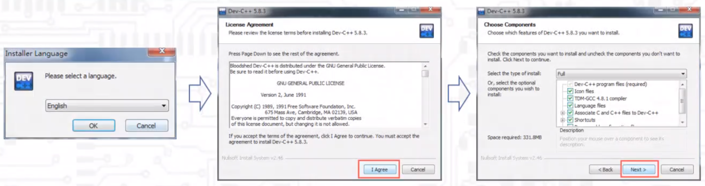
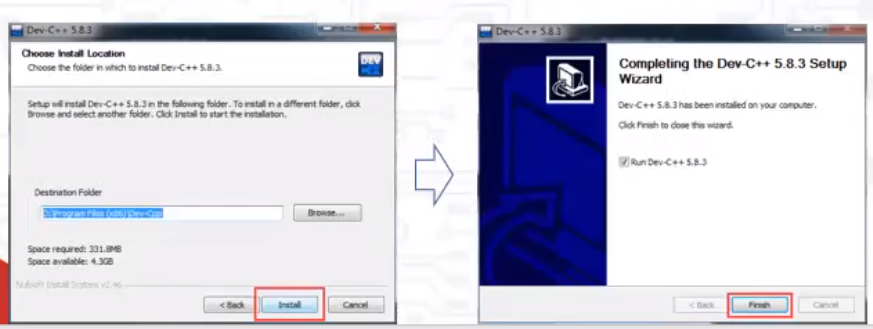
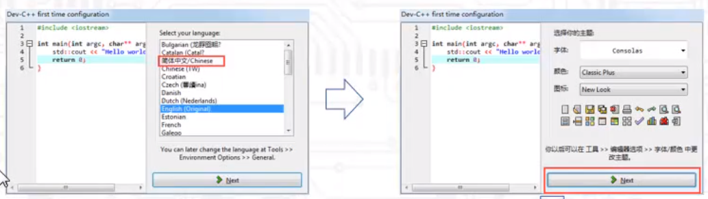
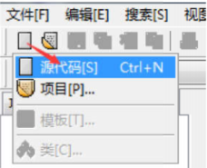
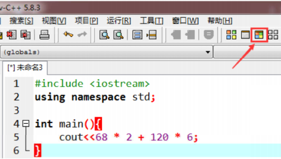
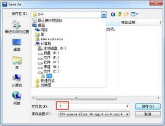
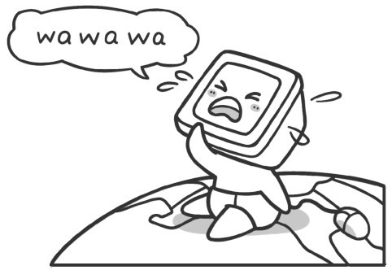

上节课我们一起讨论了编程对我们的工作和生活会带来怎样的影响，以及为什么要学习编程。这节课我们来编写第一个程序。


## 一、环境安装

Dev-CPP:  [Dev-Cpp_5.11_TDM-GCC_4.9.2_Setup.zip](https://www.yuque.com/attachments/yuque/0/2021/zip/2332029/1631627259455-33f828f6-2dcc-47ca-bb19-526a09de5afd.zip?_lake_card=%7B%22src%22%3A%22https%3A%2F%2Fwww.yuque.com%2Fattachments%2Fyuque%2F0%2F2021%2Fzip%2F2332029%2F1631627259455-33f828f6-2dcc-47ca-bb19-526a09de5afd.zip%22%2C%22name%22%3A%22Dev-Cpp_5.11_TDM-GCC_4.9.2_Setup.zip%22%2C%22size%22%3A50427666%2C%22type%22%3A%22application%2Fx-zip-compressed%22%2C%22ext%22%3A%22zip%22%2C%22status%22%3A%22done%22%2C%22taskId%22%3A%22u5371216f-87ca-4982-862c-e7b629f5719%22%2C%22taskType%22%3A%22upload%22%2C%22id%22%3A%22u7927416f%22%2C%22card%22%3A%22file%22%7D)
一起来装一下



> 提示：安装结束，第一次打开软件时，需要做设置。
仅第一步需要将语言设置为“简体中文”，其余也是使用默认设置

 

## 二、入门问题

#### 例子：开学大釆购
小美去帮同学们采购文具，一共买了 68支水笔，每支水笔2元；买了 120个文具盒，一个
文具盒6元。小美担心自己算错账，请你编程帮助小美计算出，一共应付多少钱？

#### 数学求解方法
水笔应付总价=水笔的数量 * 水笔的单价=68 * 2；
文具盒应付总价=文具盒的数量 * 文具盒的单价=120 * 6；
应付总价=水笔应付总价+文具盒应付总价=68 * 2 + 120 * 6；

## 三、第一个问题的程序实现

| **单词** | **含义** | **备注**       |
| -------------- | -------------- | -------------------- |
| include        | 包括;包含；    | [ɪnˈkluːd]        |
| input          | 输入           | [ˈɪnpʊt]          |
| output         | 输出           | [ˈaʊtpʊt]         |
| io             | 输入，输出     | input和output的缩写  |
| stream         | 河流，小河     | [striːm]            |
| use            | 使用；         | [ju:s]               |
| space          | 空间，空白；   | [speɪs]             |
| int            | 整数；         | [ˈɪntədʒər] integer的缩写 |
| main           | 主要的；       | [meɪn]              |
| end            | 结束           | [ɛnd]               |
| line           | 线条;行；      | [lʌɪn]             |

## 四，第一个程序的编写

第一步：新建源码

_第二步:_编写程序

第三步：保存、运行程序


> 几个小问题：
> 1、注意缩进（TAB）,让代码可读性更好，更美观；
> 2、注意按到insert （INS）键之后的处理（在上下左右键上方）；
> 3、注意程序报错后的调错；（如果当前行报错，要看当前行和当前行的上一行)
> 4、不小心点到行号，产生了红色的行；
> 5、按Ctrl,滚轮上滚、下滚可以放大缩小文字；

## 五、编程如此简单

计算机是通过执行一个个程序来实现各种神奇的功能。
人们要指挥计算机做事，需要编写程序，把自己的思想融入程序中，再利用这些程序按照自己的思路去指挥计算机工作。

伴随着“wa wa wa”的一阵哭声，我们来到了这个精彩的世界，现在我们也让计算机来“哭一次”。这个地方特别说一下，计算机若要把“它”想说的告诉我们，有两种方法：一种是显示在显示器屏幕上；另一种是通过喇叭发出声音。就如同我们有话想说时，一种是写在纸上，另一种是用嘴巴说出来。目前让计算机用音箱输出声音还比较麻烦，因此采用另外一种方法，即用屏幕输出“wa wa wa”。


```cpp
#include <iostream>
using namespace std;
int main()
{
    cout <<_ "wa wa wa";
}
```
所有C++语言都必须要有的框架，现在暂时不需要理解它，知道要有这个即可，以后再来详细地讲它的用途。

## 六、课堂练习

我们已经实现了由加法和乘法的运算，请你实验一下我们在数学中学到的减法和除法运算, 看看结果和自己在数学中得到的一样吗？
提示：在C++中，乘号使用*表示，除法使用/符号表示。
