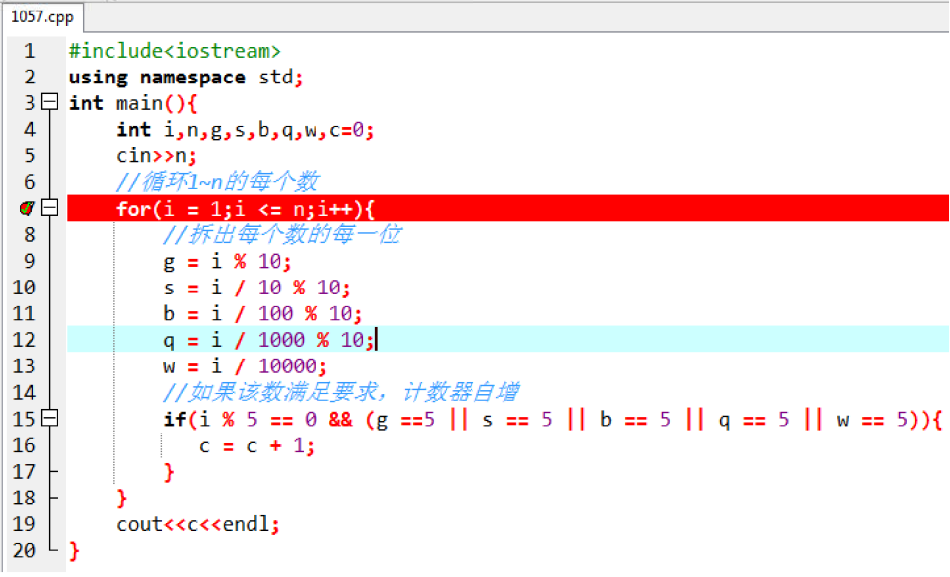
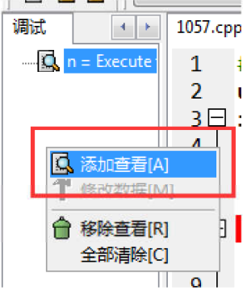

# 12、程序调错

## 错误分类：

1. 语法错误：程序的语法有误，运行报错(有红色叉)；
2. 逻辑错误：程序没有语法错误，能够正常运行，但运行的结果是错误的;

### 一、常见的语法错

**程序：**

```cpp
/ *
案例：求一个三位数各个位的和
*/
int n,g,s,b,s;
cin>>n;
b = n / 100;
s = n / 10 % 10
g = n % 10;
cout<<b + S + g<<endl;
```

| **程序报错**                                    | **错误解析**                  |
| ----------------------------------------------------- | ----------------------------------- |
| **[Error] redeclaration of ' int s'**           | **重复定义变量**s             |
| **[Error] expected ";" before 'g'**             | **在**g**之前缺少分号** |
| **[Error] ' S' was not declared in this scope** | **S**没有定义                 |

### 二、逻辑错误

#### 1057:【入门】能被5整除且至少有一位数字是5的所有整数的个数 请问下面的程序有哪些错误，请一一找出来：

#### 逻辑调错方法一：输出调错法！

```cpp
#include<iostream>
using namespacestd;
int main()
{
        int i, n, g, s, b, q, w, c;
        cin>>n;
        //循环1~n的每个数
        for (i=1; i<n; i++)
        {
                    //拆出每个数的每一位
                    g=i%10;
                    s=i/10%10;
                    b=i%100/10;
                    q=i/1000%10;
                    w=i/10000;
                    //如果该数满足要求，计数器自增
                    if (i%5==0&&g==5||s==5||b==5||q==5||w==5)
                    {
                                    c=c+1;
                    }
                    cout<<c<<endl;
        }
}
```

> **如果上述程序有误，我们应该去判断在哪一步出错的；养成良好的习惯，逐步输出调试就很重要。**  
**第一步：循环1~**n**的每个数是否有误？**  
**第二步：拆出 i 的个十百千万位是否有误？**  
**第三步：判断是否有误？**  
**第四步：计数是否有误？**

#### 方法二、单步调试法

编译：将cpp格式的源代码（检查语法是否正确），转换成exe格式的可执行文件 

运行：执行exe格式的可执行文件

单步调试：让程序逐步执行 

**第一步：设置断点，让程序在某个位置停下来**

一般断点设置在cin之后。



**第二步：在项目管理窗口中，设置要监控的变量**



**第三步：点击调试，逐步运行，并监测运行过程中变量值是否和自己预期的一致（特别是自己要知道哪些值是错误的，在运行到错误值的位置要特别留意）**


> 请注意：蓝色线所在的行表示该行尚未执行，程序要执行过这一步，该步才能生效。

