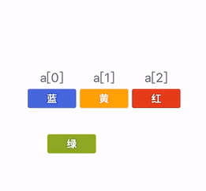

# 15.2数组元素的移动

## 一、数组元素移动

#### 1009:【入门】数组逆序

> 思路一：直接逆序输出

```cpp
/*1009 - 【入门】数组逆序
题目描述
给你m个整数，将其逆序输出。

输入
第一行一个整数m（3 <= m <= 100 )：数的个数
第二行m个整数（空格隔开）（这些数在0-106之间)。

输出
m个整数（空格隔开）。

样例
输入
3
1 7 5
输出
5 7 1
来源
数组问题

标签
数组问题
*/
#include <bits/stdc++.h>
using namespace std;
int main() {
  int a[100], n;
  cin >> n;  //数组实际元素个数
  //读入数组的n个元素
  for (int i = 0; i < n; i++) {
    cin >> a[i];
  }  
//解法一：不真正逆序，而是直接倒序输出
  int a[100], n;
  cin >> n;  //数组实际元素个数
  //读入数组的n个元素
  for (int i = 0; i < n; i++) {
    cin >> a[i];
  }
  //逆序输出
  for (int i = n - 1; i >= 0; i--) {
    cout << a[i] << " ";
  }
  return 0;
}
```


> 思路二： 真逆序，循环数组长度一半， 对称位置交换 

| a[i] | 10 | 20 | 30 | 40 | 50 | 
|----|----|----|----|----|----| 
|i| 0 | 1  | 2 | 3 | 4 |

n= 5 
0<->4
1<->3 

for (i = 0;i < n / 2;i++){
	0->n-1 (数组最后一个元素)
	1->n-2 (数组倒数第二个元素)

?	归纳得知，下标为i的元素和下标为n-i-1的元素交换

}

```cpp
  int a[100], n;
  cin >> n;  //数组实际元素个数
  //读入数组的n个元素
  for (int i = 0; i < n; i++) {
    cin >> a[i];
  }
  //解法二：逆序：循环数组长度一半，对称位置交换
  for (int i = 0; i < n / 2; i++) {
    //通过归纳法得知：下标为i的元素和下标为n-1-i的元素交换
    int t = a[i];
    a[i] = a[n - 1 - i];
    a[n - 1 - i] = t;
  }
  //输出数组元素
  for (int i = 0; i < n; i++) {
    cout << a[i] << " ";
  }
```




#### 1162:【入门】数组元素的删除


> 思路一：不删除，输出数组所有元素，如果遇到下标为x (i == x),则不输出! 

```cpp
for(i = 0;i < n;i++) {
	if(i != x) {
		cout<<a[i]<<" "；
	}
}
```

> 思路二：真删除，将数组中下标为x的元素删除！
>

从删除下标x开始，将元素顺序向前移动！

a[2]=a[3]; a[3]=a[4]; ....................  a[5]=a[6];

归纳得知：a[i]=a[i+1];//每个数=其后面的元素

```cpp
/*1162 - 【入门】数组元素的删除
题目描述
把一个数组的第x个位置的元素删除掉

输入
有三行
第一行有一个整数n( n <= 10 )
第二行有n个整数
第三行有一个整数x，为要删除的位置

输出
输出更新后的数组

样例
输入
5
1 2 3 4 5
3
输出
1 2 4 5
来源
数组问题

标签
数组问题
*/
#include <bits/stdc++.h>
using namespace std;
int main() {
  int a[10], i, n, x;
  cin >> n;  // ft组实际元素个数 〃读入数组南n个元素
  for (i = 0; i < n; i++) {
    cin >> a[i];
  }
  //读入要删除的元素的位置
  cin >> x;
  //将位置-1得到下标
  x--;
  //从删除下标X开始到n-2结束,将每个元素后面的元素前移
  for (i = x; i <= n - 2; i++) {
    a[i] = a[i + 1];
  }
  //删除结束,数组实际元素个数少了一个
  n--;
  //输出删除的结果
  for (i = 0; i < n; i++) {
    cout << a[i] << " ";
  }
  return 0;
}

```


#### 1211:【入门】数组元素的插入

> 思路：逆序循环下标为n-1~x结束，将元素顺序后移(a[i+l] = a[i]), 位置；
>
> a[i+l]=a[i] ; a[6]=a[5] a[5]=a[4] a[4]=a[3] 
>
> 在下标为x的位置插入元素y, a[x]=y;


```cpp
/*1211 - 【入门】数组元素的插入
题目描述
在一个数组的第x个位置插入一个新的数y

输入
有四行 第一行有一个整数n ( 5 <= n <= 10 ） 第二行有n个整数
第三行有一个整数x，为要插入的位置 第四行有一个整数y，为要插入的整数

输出
更新后的数组

样例
输入
5
7 2 3 4 5
2
9
输出
7 9 2 3 4 5
来源
数组问题

标签
数组问题
*/
#include <bits/stdc++.h>
using namespace std;
int main() {
  int a[11], i, n, x, y;
  cin >> n;
  for (i = 0; i < n; i++) {
    cin >> a[i];
  }
  //读入要插入的位置
  cin >> x;
  //读入要插入的元素
  cin >> y;
  x--;  //将要插入的位置修改为下标
  //从n-1开始逆序循环到x下标结束
  for (i = n - 1; i >= x; i--) {
    //将每个元素移动(复制)到后面的元素位置上
    a[i + 1] = a[i];
  }
  //在x下标的位置插入元素y
  a[x] = y;
  //数组元素个数多了一个
  n++;
  //输出插入的结果
  for (i = 0; i < n; i++) {
    cout << a[i] << " ";
  }
  return 0;
}
```


#### 1161:【入门】元素插入有序数组

 

| | |  | 
| ---- | ------------------------------- | ------------------------------- | 


要插入元素的值y=2;

> 思路：
>
> 第一步：找出要插入的元素的下标x；
>
> ?	从第一个数开始逐个比较，找到第一个a[i] >= y,下标i就是x的值!
>
> 第二步：将元素顺序后移(逆序循环n-1~x)；
>
> 第三步：在下标为x的位置插入元素y；
>

```cpp
/*1161 - 【入门】元素插入有序数组
题目描述
给你一个整数n和一个数列(数列个数不超过1000)，这个数列保证从小到大排列，
现要求将这个整数n插入到数列中，使新的数列仍然从小到大排列。

输入
第一行一个整数n ：等待插入的数量
第二行一个整数m ：数列中数的个数
第三行m个整数（空格隔开）

输出
一行整数：新的数列（空格隔开）

样例
输入
2
4
1 3 4 5
输出
1 2 3 4 5
来源
数组问题

标签
数组问题
*/
#include <bits/stdc++.h>
using namespace std;
int main() {
  int a[1000], i;
  int x, y;  // x：数组插入元素的下标，y：要插入的元素
  int n;     //等待插入的数量
  cin >> y >> n;
  for (i = 0; i < n; i++) {  //读入数组的元素
    cin >> a[i];
  }
  //假设没有元素比y大,y应该插入到最后一个元素的后面
  x = n;
    
  //第一步：寻找y应该插入的下标
  for (i = 0; i < n; i++) {
    //找到第一个元素a[i]>=y时,下标i就是y应该插入的下标
    if (a[i] >= y) {
      x = i;
      break;  //停止循环,不能继续找,因为后面的元素都比y大
    }
  }
  // cout<<x<<endl;//验证我们找到的下标是正确的
    
  //第二步：逆序从n-1开始到x结束,元素顺序后移
  for (i = n - 1; i >= x; i--) {
    a[i + 1] = a[i];
  }
    
  //第三步：在下标为x的位置插入元素y
  a[x] = y;
  n++;
  //输出插入结果
  for (i = 0; i < n; i++) {
    cout << a[i] << " ";
  }
  return 0;
}

```


## 二、数组元素移动作业

#### 1213:【入门】删除数组的最小数

#### 1157:【入门】最小数

#### 1212:【入门】移动数组元素

#### 1214:【入门】在最大数后面插入一个数

#### 1217:【入门】小明排队做操迟到

#### 1232:【入门】换位置

