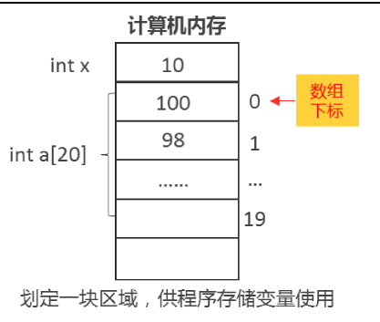
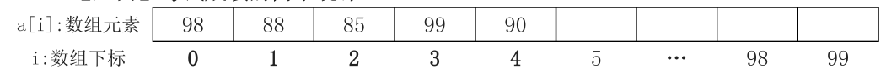

# 15、数组

## 一、数组定义

**1、为什么要定义数组？**

入门问题：期末考试结束了，王老师想要统计一下同学们分数中成绩优秀（>=90分）的人 数和成绩不及格的人数（<60）,已知班上同学的人数有20人，请你编程读入这20个人的 成绩帮助王老师做一下分数统计。

难点分析：有20位同学的成绩要计算，我们需要定义20个变量吗？如果有100位同学的 成绩要计算，我们要定义100个变量吗？

解决方法：定义长度为20的数组，来存放这20个同学的成绩；就能实现一个变量存储多个元素的目的。

> 数组：相同类型元素的集合。

数组意义：定义一个变量（容器），存储多个元素的值!
注意：
普通变量一个变量只能存储一个值，比如：int x = 10;  x只能存储一个整数！ 但有时，我们需要读入大量的值，比如100个同学的成绩，求平均分，就需要定义数组！
例子：数组的定义、赋值和输出


``````````cpp
#include <iostream>
using namespace std;
int main(){
    int x = 10;//定义一个整数
    //定义一个长度为5的整数数组,存放5个人的成绩
    //定义变量时,[5]代表数组长度为5
    //定义数组:不为数组元素赋值,那么数组元素的初始值是随机的 
    int a[5];
    //为数组元素赋值
    a[0] = 100;
    a[1] = 98;
    a[2] = 95;
    a[3] = 80;
    //a[4] = 92;
    //输出数组中每个元素的值
    //访问数组时,[0]代表数组下标
    cout<<a[0]<<endl;
    cout<<a[1]<<endl;
    cout<<a[2]<<endl;
    cout<<a[3]<<endl;
    cout<<a[4]<<endl;
    //通过循环数组的下标来输出数组元素
    int i;
    //i<=4:下标不能超出数组下标范围
    for(i = 0;i < 5;i++){
    	cout<<a[i]<<endl;
    }
}
``````````



**注意：长度为n的数组，下标从0~ n-1,不能超过这个范围访问数组元素，如果超过就是错的，语法上叫“越界” 了！** 

**例子：定义长度为5的数组，存储一个班同学的成绩(分数大家任意赋值)，请问该班级 同学的总分和平均分分别是多少？**

**例子：定义数组的同时为数组元素赋值！**

**注意：如果定义数组的同时为数组元素赋值，但赋值的个数，不足数组长度，那么整数数 组会补充0!**

**例子：从键盘读入数组元素！**

#### 1423:【入门】考试成绩的简单统计



写法一：先做一个循环，读入数组每个元素的值，再做一个循环，统计优秀分数的个数

```cpp
#include <iostream>
using namespace std;
int main(){
    //定义长度为100的数组，最多存放100个人的成绩
    int a[100]={0};
    //n:代表了数组中实际存储元素的个数
    int n,i,c =0;
    cin>>n;
    //读入n个成绩的值
    for(i =0;i< n;i++){
    	cin>>a[i];	
    }
    //循环数组的每个成绩，判断是否是优秀
    for(i= 0;i <n;i++){
        if(a[i]>=90){
            c++;
        }
    }
    cout<<c<<end1;
}
```


写法二：每读入一个分数，就判断该分数是否是优秀的!

```cpp
#include <iostream>
using namespace std;
int main() {
  //定义长度为100的数组,最多存放100个人的成绩
  int a[100];
  // n:代表了数组中实际存储元素的个数
  int n, i, c = 0;
  cin >> n;
  //读入n个成绩的值
  for (i = 0; i < n; i++) {
    cin >> a[i];
    //每读入一个分数就判断其是否优秀
    if (a[i] >= 90) {
      c++;
    }
  }
  cout << c << endl;
}
```


## 二、课堂练习

#### 1153:【入门】查找“支撑数”

```
1153 - 【入门】查找“支撑数”
题目描述
在已知一组整数中，有这样一种数非常怪，它们不在第一个，也不在最后一个，而且刚好都比左边和右边相邻的数大，你能找到它们吗？

输入
第一行为整数m，表示输入的整数个数。（ 3<= m <=100 ) 第二行为m个整数。
输出
若干个支撑数，每行一个。

样例
输入复制
14
1 3 2 4 1 5 3 9 7 10 8 23 85 43
输出复制
3
4
5
9
10
85
来源
数组问题
```


| a[i]: 数组元素 | 1    | 3    | 2    | 4    | 1    | 5    | …    | 85   | 43   |
| -------------- | ---- | ---- | ---- | ---- | ---- | ---- | ---- | ---- | ---- |
| i: 数组下标    | 0    | 1    | 2    | 3    | 4    | 5    | …    | n-2  | n-1  |

**思路：由于第一个数和最后一个数不可能是支撑数，那么我们循环的下标范围i = 1~ n-2 ,对于下标为i的元素a[i]而言，左侧的数为a\[i-1],右侧的数为a[i+1]。**

```cpp
/*1153 - 【入门】查找“支撑数”
题目描述
在已知一组整数中，有这样一种数非常怪，它们不在第一个，也不在最后一个，而且刚好都比左边和右边相邻的数大，你能找到它们吗？

输入
第一行为整数m，表示输入的整数个数。（ 3<= m <=100 ) 第二行为m个整数。

输出
若干个支撑数，每行一个。

样例
输入
14
1 3 2 4 1 5 3 9 7 10 8 23 85 43
输出
3
4
5
9
10
85
来源
数组问题
*/
#include <bits/stdc++.h>
using namespace std;
int main() {
  /*  它们不在第一个，也不在最后一个，而且刚好都比左边和右边相邻的数大*/
  int a[100], n, i;
  cin >> n;                  //读入数组中实际元素的个数
  for (i = 0; i < n; i++) {  //读入数组中的元素
    cin >> a[i];
  }
  for (i = 1; i <= n - 2; i++) {  //寻找支撑数
    if (a[i] > a[i - 1] &&
        a[i] > a[i + 1]) {  //如果当前数比左右都大，就是支撑数
      cout << a[i] << endl;
    }
  }

  /*   for (i = 0; i < n; i++) {
      cin >> a[i];
      if (i > 1 && a[i - 1] > a[i - 2] &&
          a[i - 1] > a[i]) {  //如果当前数比左右都大，就是支撑数
        cout << a[i - 1] << endl;
      }
    } */

  return 0;
}

```

**注意：长度为n的数组，下标为\(0~ n-1)。如果在程序中访问a[i-1], 下标就不能从0开始访问；如果访问a\[i+l],下标就不能循环到n-1。**


#### 1156:【入门】排除异形基因

```cpp
/*1156 - 【入门】排除异形基因
题目描述
神舟号飞船在完成宇宙探险任务回到地球后，宇航员张三感觉身体不太舒服，
去了医院检查，医生诊断结果：张三体内基因已被改变，
原有人体基因序列中已经被渗入外星球不明异形生物基因，
但可喜的是，这些异形基因都有一个共同的特征，
就是该基因序号的平方除以7的余数都是1，要赶快清除掉，
否则会危害整个人类。赶快行动吧。

输入
第一行是一个整数n（基因个数,3<=n<=200）
第二行是n个整数（张三的基因序列）

输出
去除异形基因后的正常序列，空格隔开

样例
输入
4
6 2 8 12
输出
2 12
来源
数组问题

标签
数组问题
*/
#include <bits/stdc++.h>
using namespace std;
int main() {
  /*
将数组中序号的平方除以7的余数都是1这类数去除掉 输出剩余的元素
思路：循环数组的每个元素，如果是满足a[i] * a[i] % 7 != 1 说明是好的基因，输出
*/
  int a[1000], n;
  cin >> n;  //读云数如实际元素的个数
  for (int i = 0; i < n; i++) {
    cin >> a[i];
    if (a[i] * a[i] % 7 != 1) {
      cout << a[i] << " ";  //判断如果不是异形基因，则输出
    }
  }
  return 0;
}
```


#### 1155:【入门】找找谁的身高超过全家的平均身高

第一步：求和

第二步：求平均

第三步：求哪些人在平均之上


| a[i]：数组元素 | 175  | 160  | 172  | 158  | 178  | 162  | ...  |      |      |
| -------------- | ---- | ---- | ---- | ---- | ---- | ---- | ---- | ---- | ---- |
| i：数组下标    | 0    | 1    | 2    | 3    | 4    | 5    | ...  | n-2  | n-1  |

```cpp
/*1155 - 【入门】找找谁的身高超过全家的平均身高
题目描述
找找谁的身高超过全家的平均身高。全家n口人，输入输出数据如下：
(平均身高保留一位小数)

输入
第一行有一个整数n( 1 < n < 11 )。第二行是n个整数，用空格隔开。
输出
第一行为全家的平均身高（保留一位小数）；第二行有若干个数，为超过平均身高的人的身高厘米数。

样例
输入
7
175 160 172 158 178 162 142
输出
AVE=163.9
1:175 3:172 5:178

来源
数组问题
标签
数组问题
*/
#include <bits/stdc++.h>
using namespace std;
int main() {
  /*
第一步：求和
第二步：求平均
第三步：求哪些人在平均之上
注意输出格式
*/
  int a[10], n, s = 0;
  cin >> n;  //数组中实际元素个数
  //读入n个人的身高
  for (int i = 0; i < n; i++) {
    cin >> a[i];
    //每读入一个人的身高,加到总和上
    s    += a[i];
  }
  double v = s * 1.0 / n;
  cout << "AVE=" << fixed << setprecision(1) << v << endl;
  //求哪些人的身高超过平均身高
  for (int i = 0; i < n; i++) {
    if (a[i] > v) {
      cout << i + 1 << ":" << a[i] << " ";
    }
  }
  return 0;
}
```


## 三、数组基础作业

#### 1231:【入门】考试成绩的分布情况

#### 1160:【入门】打折优惠

#### 1316:【入门】橘子称重

#### 1388:【入门】陶陶摘苹果

#### 1174:【入门】求和

#### 1397:【入门】完美的偶数？

#### 1158:【入门】输出奇数和偶数

附加题：

#### 1354:【入门】拿到某个数的概率是多少？

#### 1357:【入门】哪个厂家的零件更标准？


## 四、找数问题

#### 1154:[入门】数组元素的查找

| a[i]：数组元素 | 1    | 2    | 6    | 6    |      |      | ...  |      |      |
| -------------- | ---- | ---- | ---- | ---- | ---- | ---- | ---- | ---- | ---- |
| i：数组下标    | 0    | 1    | 2    | 3    | 4    | 5    | ...  | n-2  | n-1  |

x = 6;//表示要找的数

> 思路：循环数组的每个元素，判断是否是要找的元素x,如果是则输出数组下标i+1。 如果找不到，则输出-1。

解法一：通过变量f来标记是否曾经找到过x (循环结束之后才能判定x是否找到过) 

```cpp
/*1154 - 【入门】数组元素的查找
题目描述
给你m个整数，查找其中有无值为n的数，有则输出该数第一次出现的位置,没有则输出-1。

输入
第一行一个整数m：数的个数 ( 0 <= m <= 100 ) 第二行m个整数（空格隔开）( 这些数在
0-1000000范围内 ) 第三行为要查找的数n；

输出
n的位置或-1

样例
输入
4
1 2 3 3
3
输出
3
来源
数组问题

标签
数组问题
*/
#include <bits/stdc++.h>
using namespace std;
int main() {
  int a[100], n, x;
  //读入数组中实际元素个数
  cin >> n;
  //读入数组的n个元素
  for (int i = 0; i < n; i++) {
    cin >> a[i];
  }
  cin >> x;   //读入要找的数x
  int f = 0;  // f=0表示x没有找到
  for (int i = 0; i < n; i++) {
    //如果找到了第一个出现的x
    if (a[i] == x) {  //逐个判断是否是x
      f = 1;
      cout << i + 1 << endl;
      break;  //停止循环
    }
  }
  //循环结束,如果没有找到x,则输出-1
  if (f == 0) {
    cout << -1 << endl;
  }
  return 0;
}
```

解法二:使用变量p来存储X第一次出现的位置,设置P的初始值为-1 (假设X没有找到)

```cpp
  int a[100], n, x;
  int p = -1;  //存放 x 第一次出现的位置 (position), 假设没有找到
  cin >> n;    //读入数組中实际元素个数
  //读入数组的n个元素
  for (int i = 0; i < n; i++) {
    cin >> a[i];
  }
  //读入要找的数x
  cin >> x;
  //逐个判断a[i]是否是X
  for (int i = 0; i < n; i++) {
    //如果找到了第一个出现的x
    if (a[i] == x) {
      p = i + 1;  //记录x彿一次出现的位置
      break;      //停止循环
    }
  }
  cout << p << endl;
```

#### 1152:【入门】求n个数的最大值和最小值

> 思路1：假设第一个数是最大数，循环后面所有的元素，如果有比假设的最大数还大的数, 则替换最大数。
>

| a[i]:数组元素 | 3    | 1    | 99 | 6    | 0   |     | ... |  |      |      |
| ---- | ---- | ---- | ---- | ---- | ---- | ----- | ---- | ---- | ---- | ---- |
| i：数组下标 | 0 | 1 | 2 | 3 | 4 | 5 | ... | n-2 | n-1 |      |


max：存放最大数的“擂台; min：存放最小数的“擂台 

max = a[0];

```cpp
/*1152 - 【入门】求n个数的最大值和最小值
题目描述
任意输入n个整数，把它们的最大值，最小值求出来.

输入
输入只有一行，包括一个整数n(1<=n<=20),后面跟着n个数.
每个数的范围在0到32767之间。

输出
输出只有一行,包括2个整数。

样例
输入
5 1 99 3 6 0
输出
99 0
来源
数组问题

标签
数组问题
*/
#include <bits/stdc++.h>
using namespace std;
int main() {
  int a[20], n, max, min;
  cin >> n;
  //读入数组元素
  for (int i = 0; i < n; i++) {
    cin >> a[i];
  }
  max = a[0];  //假设最大数是第一个数
  min = a[0];  //假设最小数是第一个数
  //循环数组其余的元素,如果有比max还大的数,替换max
  for (int i = 1; i < n;
       i++) {  // i不需要从.开始循环,因为a[0]已经是假设的最大值了
    if (a[i] > max) {
      max = a[i];
    }
    if (a[i] < min) {
      min = a[i];
    }
  }
  cout << max << " " << min << endl;
  return 0;
}
```

注意，如果拿到了最大值，不能一下子就得到最大值的下标；但如果拿到了最大值的下标，就能一下子拿到最大值，因此，我们很多时候求最大值下标更加方便！ 

> 思路2：如果要找最大数的下表，比如用max存储最大数的下标。假设max = 0,也就是假设第一个数最大，循环后续的所有元素，如果a[i] > a[max],替换max为i。

max=0

```cpp
  int a[20], n, max, min;
  cin >> n;
  for (int i = 0; i < n; i++) {//读入数组元素
    cin >> a[i];
  }
  max = 0;  //假设最大数是第一个数
  min = 0;  //假设最小数是第一个数
  //循环数组其余的元素,如果有比a[max]还大的数,替换max
  // i不需要从0开始循环,因为a[0]已经是假设的最大值了
  for (int i = 1; i < n; i++) {
    if (a[i] > a[max]) {
      max = i;
    }
    if (a[i] < a[min]) {
      min = i;
    }
  }
  cout << a[max] << " " << a[min] << endl;
```


## 五、找数问题可选作业

#### 1168:【入门】歌唱比赛评分

#### 1170:【入门】最大数

#### 1218:【入门】摘苹果

