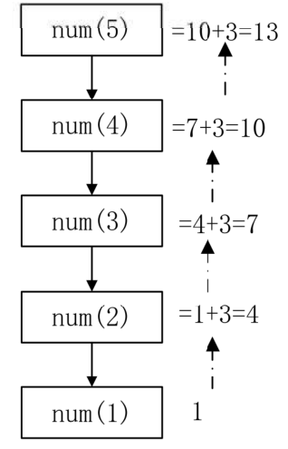
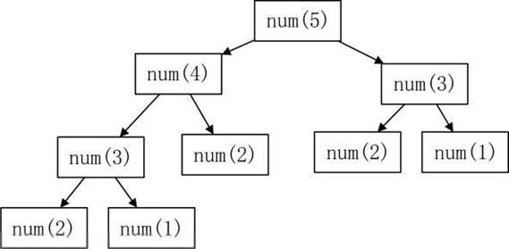

# 19、递归

## 一、 什么是递归

从前有座山，山里有座庙，庙里有个老和尚：
老和尚对小和尚说，我给你讲个故事吧，故事的内容是：
  从前有座山，山里有座庙，庙里有个老和尚：
  老和尚对小和尚说，我给你讲个故事吧，故事的内容是：
    从前有座山，山里有座庙，庙里有个老和尚
    老和尚对小和尚说，我给你讲个故事吧，故事的内容是：

### 1、 递归：函数的自我调用！

数列递归：如果一个数列的项与项之间存在关联性，那么可以使用递归实现；

原理：如果一个函数可以求A(n),那么该函数就可以求A(n-1),就形成了递归调用; 

注意：起始项是不需要求解的，是已知条件；

### 2、 递归求解问题的过程：

第一步：找出规律

第二步：函数调用自己求解前面的项

第三步：交代起始项，让递归能够停止

##  二、 课堂练习

#### 例子：定义函数，递归求解等差数列1 4 7 10 13……第n项的值 递归规律：A(n) = A(n-l) + 3

等差数列：相邻两项的差值相等！

num(5) = num(4) + 3

=(num(3) +3)+3

=((num(2) + 3) + 3) + 3

=(((num(1) + 3) + 3) + 3) + 3

```CPP
/*
求解首项为1,差值为3的等差数列的第n项的值
1 4 7 10 13...
*/
#include <bits/stdc++.h>
using namespace std;
int num(int n) {
  int r;
  //交代起始项,防止死循环
  //递归的出口
  if (n == 1) {
    r = 1;
  } else {
    r = num(n - 1) + 3;
  }
  return r;
}
int main() {
  int i, x;
  //输出数列的前10项的值
  for (i = 1; i <= 10; i++) {
    x += num(i);
    cout << x << endl;
  }
}

```

 

#### 例子：定义函数，递归求解等比数列：1 2 4 8 16…第n项的值

递归规律：A(n)=A(n-1)*2

```CPP
r = num(n - 1) * 2;
```

#### 例子：定义函数，递归求解的阶乘的值

提示：5！=5 * 4 * 3 * 2 * 1=5 * 4!
规律：n!= n * (n-1)!     

​    A(n)=n * A(n-1)
n!表示n的阶乘，n!=n* (n-1)* (n-2)* …1
n! = n* (n-1)* (n-2) * ...1 = n * (n-1)!
(n-1) ! =(n-1)* (n-2) * ...* 1

```CPP
r = n * num(n - 1);
```


#### 1238:【入门】统计每个月兔子的总数

```CPP
/*1238 - 【入门】统计每个月兔子的总数
题目描述
有一对兔子，从出生后第3个月起每个月都生一对兔子，一对小兔子长到第三个月后每个月又生一对兔子，假如兔子都不死，问第n个月（n<=50）的兔子总数为多少对？

输入
输入1个整数n，表示第几个月

输出
第n个月兔子的总数量有多少对？

样例
输入
9
输出
34
来源
递归 递推

标签
递归递推
*/
```

第1个月：a

第2个月：a

第3个月：a b

第4个月：a b c

第5个月: a b c d e

请问，数列的规律是什么？

1 1 2 3 5 8

规律：a (n) = a (n-1) + a (n-2)(斐波拉契数列)

注意交代2个起始项(第1项和第2项)

```CPP
if(n == 1 || n == 2)

r = num(n - 1) + num(n - 2);
```


> 注意：
>
> (1)当n的值越来越大，执行时间会越来越长，直到超时！
>

 因为随着Q的值越来越大，重复求解的项会越来越多，  这棵“树”会越来越大，因此会非常耗时！



 

> (2) int最多表达到2的31次方-1, 10位的整数，如果超过这个范围，需要使用long long来表 达，long long最多表达到2的63次方-1,约20位的整数。
>

### 4、递归存在的问题

由于递归是函数对于自己的调用，因此在n的值比较大时，存在太多的重复求解的过程， 而且这些重复求解的过程都必须等所有项计算完毕，才能汇总出总解；因此效率很低。

### 5、使用数组和递推的方法来提高递归的效率

改进方案一：采用数组来记录每个月兔子的数量，这样的话，如果想要知道a[n-1]和a[n-2] 就不需要再次求解而是直接从数组获取。

| 1    | 1    | 2    | 3    | 5    | 8    | n    |
| ---- | ---- | ---- | ---- | ---- | ---- | ---- |

数组的每个单元格用来存放每个月兔子有多少对！

```CPP
#include <bits/stdc++.h>
using namespace std;
int main() {
  long long a[60], n;
  cin >> n;
  //第一个月和第二个月是已知的
  a[1] = 1;
  a[2] = 1;
  //从第3个月开始求解
  for (int i = 3; i <= n; i++) {
    a[i] = a[i - 1] + a[i - 2];
  }
  cout << a[n];
}
```

改进方案二：采用两个变量x和y分别记录录第n-1个月和第n-2个月兔子的数量。

| 1    | 1    | 2    | 3    | 5    |      |      |
| ---- | ---- | ---- | ---- | ---- | ---- | ---- |
|      |      | x    | y    | r    |      |      |

```CPP
  long long x, y, r, i, n;
  cin >> n;
  x = 1;  //第1个月
  y = 1;  //第2个月
  for (i = 3; i <= n; i++) {
    r = x + y;  //第x个月
    x = y;
    y = r;
  }
  //如果是问第一个月或者第二个月
  if (n == 1 || n == 2) {
    cout << 1 << endl;
  } else {
    cout << r << endl;
  }
```

## 三、课堂练习

#### 1146:【入门】求S的值

```CPP
/*1146 - 【入门】求S的值
题目描述
求S=1+2+4+7+11+16……的值刚好大于等于5000时S的值。

输入
无

输出
一行，一个整数。

来源
函数问题

标签
函数问题
*/
#include <bits/stdc++.h>
using namespace std;

/*
数列：1 2 4 7 11 16
A(2)=A(1)+1 A(3)=A(2)+2 A(4)=A(3)+3
A(n)=A(n-1)+n-1
求数列的第n项的值
*/
int num(int n) {
  int r;
  if (n == 1) {
    r = 1;
  } else {
    r = num(n - 1) + n - 1;
  }
  return r;
}
int main() {
  int s = 0, i = 1;
  while (s < 5000) {
    s = s + num(i);
    i++;
  }
  cout << s << endl;
}
```

#### 1147:【入门】求 1/1+1/2+2/3+3/5+5/8+8/13+13/21...... 的前 n 项的和

```CPP
/*1147 - 【入门】求1/1+1/2+2/3+3/5+5/8+8/13+13/21……的前n项的和
题目描述
求1/1+1/2+2/3+3/5+5/8+8/13+13/21+21/34……的前n项的和。

输入
第1行：一个整数n（1 <= n <= 30 ）。

输出
一行：一个小数，即前n项之和（保留3位小数）。

样例
输入
20
输出
12.660
来源
函数问题

标签
函数问题
*/
#include <bits/stdc++.h>
using namespace std;
int main() {
  /*
分子：1 1 2 3 5 8 13  num(i)
分母：1 2 3 5 8 13 21 num(i+1)
*/
  int n;
  cin >> n;
  int a[n + 1];
  a[1] = 1;
  a[2] = 1;
  for (int i = 3; i <= n + 1; i++) {
    a[i] = a[i - 1] + a[i - 2];
  }
  double s = 0;
  // cout << a[n];
  for (int i = 1; i <= n; i++) {
    s += a[i] * 1.0 / a[i + 1];
  }
  cout << fixed << setprecision(3) << s;
  return 0;
}

```

## 四、可选作业

#### 1148:【入门】数数小木块

#### 1145:【入门】数列求和

#### 1367:【入门】骨牌铺方格

