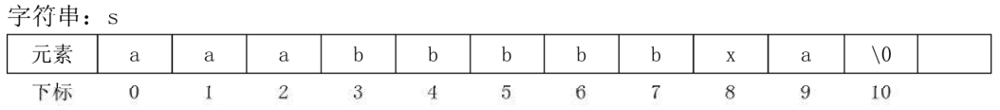

# 20.2、字符数组进阶

## 七、字符数组进阶问题

#### 1100:【入门】词组缩写

```CPP
/*1100 - 【入门】词组缩写
题目描述
定义：一个词组中每个单词的首字母的大写组合称为该词组的缩写。
比如，C语言里常用的EOF就是end of file的缩写。 输入
测试数据占一行，有一个词组，每个词组由一个或多个单词组成；每组的单词个数不超过10个，每个单词有一个或多个大写或小写字母组成；
单词长度不超过10，由一个或多个空格分隔这些单词。

输出
输出规定的缩写

样例
输入
end of file
输出
EOF
来源
字符串

标签
字符串
*/
```

单词：
End of file
end of file
  end Of file

第一步：要获得每个单词的首字母
如果是第一个字符，那么不是空格就是首字母；
如果不是第一个字符，当前字符不是空格，且上一个(s[i-1])字符是空格，则是首字母 

```CPP
  char s[1000];  //存储词组
  int i;
  gets(s);
  //循环每个字符,判断输出首字母
  for (i = 0; i < strlen(s); i++) {
    //如果是首字母
    //如果是第一个字符,且不是空格则是首字母
    if (i == 0 && s[i] != ' ') {
      cout << s[i];
      //如果不是第一个字符,则要满足当前字符不是空格,且上一个字符是空格
    } else if (i != 0 && s[i] !=' ' && s[i - 1] == ' ') {
      cout << s[i];
    }
  }
```

第二步：判断，如果该字母是小写，转换为大写输出，如果是大写则直接输出

```CPP
char up(char c) {
  if (c >= 'a' && c <= 'z') {
    c = c - 32;  // c = c - ('a' - 'A');
  }
  return c;
}
```


#### 1103:【基础】字符串压缩



aaabbbbbxa
3a5bxa
问题：统计连续相同的字符的个数！
思路：
准备一个计数器，每遇到一个字符，计数器就自增，用来统计连续相同字符的个数。
每统计一次，就判断连续相同的字符是否结束，如果结束，输出次数+字符，清空计数器, 统计下一个连续相同的字符的出现次数！

```CPP
/*1103 - 【基础】字符串压缩
题目描述
输入字符串，输出压缩后的字符串。
压缩的方法是把连续的相同字母压缩为"长度+字母"的形式，
在本题中，单个的字母不需要压缩。

输入
一行，一个字符串,只包含小写英文字母,长度不超过255。

输出
样例
输入
aaabbbbbx
输出
3a5bx
来源
字符串

标签
字符串
*/
#include <bits/stdc++.h>
using namespace std;
int main() {
  char s[300];
  int i, c = 0;  // c:用来统计连续相同字符出现的次数
  gets(s);
  //循环每个字符
  for (i = 0; i < strlen(s); i++) {
    c++;  //计数器自增
    //判断连续相同的字符是否结束
    // i == strlen(s)-1 || s[i] != s[i+l]
    if (s[i] != s[i + 1]) {
      //如果字符出现1次,不压缩
      if (c == 1) {
        cout << s[i];
      } else {
        cout << c << s[i];
      }
      c = 0;  //计数器清零
    }
  }
  return 0;
}

```

## 八、字符数组相关函数及习题

| 字符串函数           | 函数含义                             | 备注                                                         |
| -------------------- | ------------------------------------ | ------------------------------------------------------------ |
| strlen(st);          | 求字符串长度                         |                                                              |
| strcmp(s1, s2);      | 字符串比较：按照字典排序比较大小     | 如果si的字典码大，返回正数；如果 字典码相等返回0；如果s2的字典码大返回负数； |
| strncmp (s1, s2, n); | 把st1, st2的前n个进行比较            |                                                              |
| strcat (s1, s2);     | 将s2连接到s1的后面                   | 注意，s1要有足够的空间存放                                   |
| strncat (s1, s2, n); | 将s2的前n个字符连接到s1的后面        |                                                              |
| strcpy (s1, s2);     | 将s2的内容拷贝给s1,替换s1的内容      |                                                              |
| strcpy (st1,st2,n);  | 将s2的前n个字符拷贝给S1,替换s1的内容 |                                                              |


#### 1107:【基础】求英文句子中的最长单词

> 思路：
> 第一步，分解每一个单词，输出他们
> 准备一个空字符串(char w[100])存放每个单词
> 遍历字符串的每个字符，如果当前字符不是空格，则是单词的一部分，放到w中 每放一个字符都判断一下单词是否结束，如果结束，存\0,输出w,清空w
> 第二步，采用打擂台，比较出最长的单词
> 准备一个空字符串r (都是\0)用来存放最长的单词，用循环的每个单词的长度和这个字 符串比较，如果某个单词的长度〉r的长度，r替换为当前的单词！

```CPP
/*1107 - 【基础】求英文句子中的最长单词
题目描述
一个英文句子（长度不超过255），只含有字母和空格，输出最长的一个单词。
如有多个长度相同的单词，则输出最前面的一个。

输入
一个字符串。

输出
一个字符串。

样例
输入
in which four coins
输出
which
来源
字符串

标签
字符串
*/
#include <bits/stdc++.h>
using namespace std;
int main() {
  // w用来存放每个单词,s是英文句子字符串.
  char s[1000], w[100], r[100] = {'\0'};
  int i, k;
  gets(s);
  k = 0;
  for (i = 0; i < strlen(s); i++) {
    //如果s[i]不是空格,那么就是单词的一部分,存到w中
    if (s[i] != ' ') {
      w[k] = s[i];
      k++;
      //如果当前单词结束了
      if (s[i + 1] == ' ' || s[i + 1] == '\0') {
        //存W的结束标记,输出W,清空W
        w[k] = '\0';
        //输出W
        // cout<<w<<endl;
        if (strlen(w) > strlen(r)) {
          strcpy(r, w);  //将 w 拷贝给 r
        }
        k = 0;
      }
    }
  }
  cout << r << endl;
  return 0;
}

```

> 还可以使用string方式处理，见解法2


#### 1012:【基础】我是第几个单词

> 第一步：分解出每个单词及每个单词是第几个单词
> 第二步：每个单词逐个和单词f比较，如果就是f,则得到是第几个
> 顺便统计一下总字符个数
> 第三步：如果没有找到这个单词，就输出总字符输出

```CPP
/*1012 - 【基础】我是第几个单词
题目描述
输入一个英文句子，例如：“This is a Book."，可以看到句子是以“.”来作为结束符号的，
并且单词之间以一个空格来分隔。接着再输入一个单词A，
请找出首次在句子中出现的与A相同的单词，是句子中的第几个单词，
若不存在，则输出该句子中单词字符的总个数。
例如对上句子而言，若输入单词“is”，则应输出：2 若输入单词“isa”，则应输出：11

输入
第一行为以‘.’结束的一个词组（仅由若干个单词组成，单词间由一空格隔开，
除单词和最后的“.”以外，不含其它字符）
第二行是一个单词（不含空格）

输出
一个整数

样例
输入
This is a Book.
Book
输出
4
来源
字符串

标签
字符串
*/
#include <bits/stdc++.h>
using namespace std;
int main() {
  /*1.分解并输出每个单词，并统计每个单词是第几个单词
This 1
is 2
a 3
Book 4
2.判断每个单词是否是要找的单词，如果是，输出单词是第几个单词
3.判断如果没有找到这个单词，输出字符总数量
*/
  char s[1000], f[100],
      w[100];  // s代表英文句子，w代表每个单词，f代表要找的单词
  int k = 0;         // k表示一个单词w的下标
  int c = 0, r = 0;  // c：统计第几个单词 r代表统计字符数量
  bool x = false;    //假设没有找到对应单词
  gets(s);
  gets(f);
  //遍历每个字符，分解单词
  for (int i = 0; i < strlen(s); i++) {
    //如果当前字符不是空格，则说明是单词的一部分，存入w
    if (s[i] != ' ' && s[i] != '.') {
      w[k] = s[i];
      k++;
      //如果单词结束
      if (s[i + 1] == ' ' || s[i + 1] == '.') {
        w[k] = '\0';
        c++;
        r += strlen(w);  //字符数量
        // cout<<w<<" "<<c<<endl;//输出测试
        if (strcmp(w, f) == 0) {  //判断w是否是要找的单词f
          x = true;               //表示找到了
          cout << c;
          break;
        }
        //清空w,存储下一个单词(从下标为.的位置重新存起)
        k = 0;
      }
    }
  }
  //如果没有找到相关单词
  if (x == false) {
    cout << r;
  }
  return 0;
}

```


#### 1130:【入门】简单a+b

```CPP
/*1130 - 【入门】简单a+b
题目描述
张晓菲同学做了简单的ab求和的问题。但是，如果要求输入的情况不是a和b，而是整个加法表达式呢？
请想办法，计算加法表达式的结果。

输入
输入一个加法表达式，如1+2=，或者23+58=。（注意：做加法的2个整数都在0~109的范围内）

输出
计算出输入表达式的正确结果

样例
输入
1+2=
输出
3
来源
字符串

标签
字符串
*/
#include <bits/stdc++.h>
using namespace std;
//将给定的字符数组存储的整数,转换为整数格式
// char s[] = "1234" -> int x = 1234 =4*1+3*10+2*100+1*1000
int num(char s[]) {
  int r = 0;
  int t = 1;  //表示10的n次方也就是1 10 100 1000
  for (int i = strlen(s) - 1; i >= 0; i--) {
    r = r + (s[i] - '0') * t;
    t = t * 10;
  }
  return r;
}
int main() {
  /*'第一步:分解并输出求和的2个整数(整数以字符数组的形式进行存储) 求出+的下标
  将+之前的字符拷贝给si, +之后的字符拷贝给S2
  第二步:将2个字符数组存储的整数,转换为实际的整数格式
  第三步:求和
  */
  char s[100], s1[50] = {'\0'}, s2[50] = {'\0'};
  int p;
  cin >> s;
  // 234+5678=
  //求+的下标
  for (int i = 0; i < strlen(s); i++) {
    if (s[i] == '+') {
      p = i;
      break;
    }
  }
  // cout<<p<<endl;
  //拷贝+左侧的数字
  for (int i = 0; i < p; i++) {
    sl[i] = s[i];
  }
  //拷贝+右侧的数字	一
  int k = 0;  //表示s2的下标
  for (int i = p + 1; i < strlen(s) - 1; i++) {
    s2[k] = s[i];
    k++;
  }
  // cout<<num(sl)<<" "<<num(s2)<<endl;
  cout << num(sl) + num(s2) << endl;
}
```

## 九、字符数组综合作业

1106:【入门】统计单词个数
1111：【基础】找最长单词
1129:【入门】简单a*b
1408:【入门】合法的变量名？
1117:【基础】重新排列
1114:【基础】趣味填空
