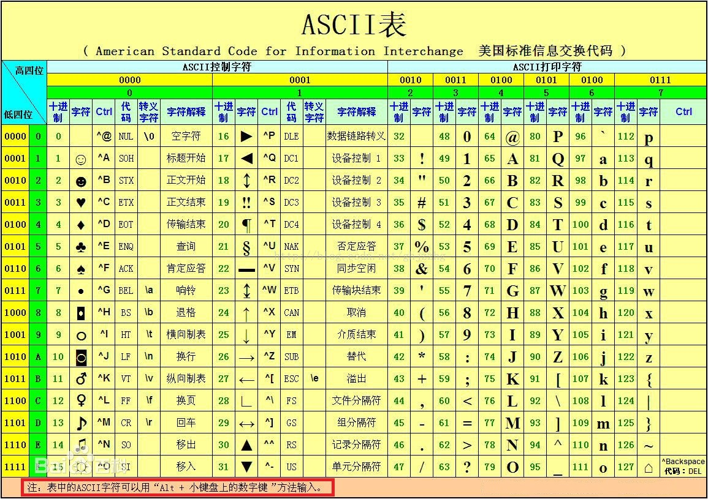
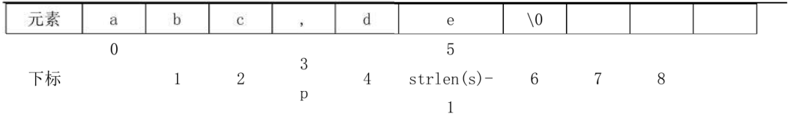
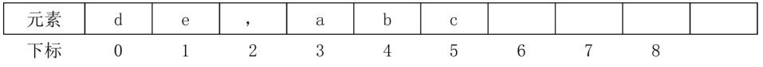
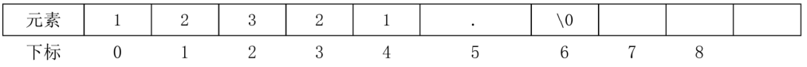
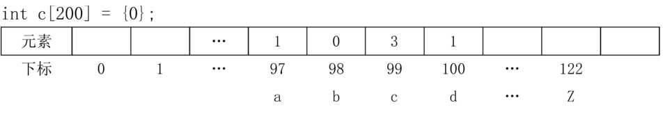
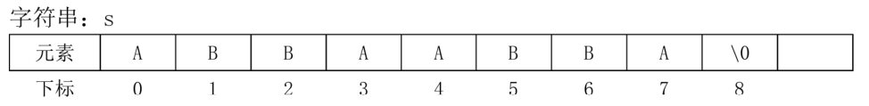

# 20、字符数组

## 一、什么是字符
char类型：字符类型，可以存储一个字符；字符在内存中以ASCII码的形式进行存储(占 1个字节)。




例子：定义一个大写字母，请获取这个大写字母对应的编码，利用编码表的规律求出对应的小写字母！

```CPP
#include <bits/stdc++.h>
using namespace std;
int main() {
  /*
  定义字符存储大写字母，得到编码，并得到对应的小写字母
  */
  char c;  //存储大写字母
  cin >> c;
  //获取字符对应的编码
  int x = c;
  cout << x << endl;
  //每个小写字母的编码,比对应的大写字母的编码大32
  //获取大写字母对应的小写字母的编码
  x = x + 32;
  //将编码赋值给字符,得到编码对应的字符
  c = x;
  cout << c << endl;
}
```
> 注意：
> (1)    字符本质：编码！
> (2)	C++的字符釆用 ascii 编码！
> (3)	常见的字符的编码：’A'-65 'a'-97 ' O'-48


例子：从键盘读入一个字母，如果是大写转换为对应小写，如果是小写转换为对应大写。
解法一：获取字母对应的编码，通过编码表来判断是大写还是小写！

```CPP
/*
从键盘读入一个英文字母，如果是小写转大写，如果是大写转小写
*/
#include <bits/stdc++.h>
using namespace std;
int main() {
  char c;  //存储字符
  int x;   //存储字符的编码
  cin >> c;
  x = c;  //获得字符对应的编码
  //如果是大写字母
  if (x >= 65 && x <= 90) {
    x = x + 32;  //得到对应的小写的编码
    c = x;       //将编码转换为字符
  } else if (x >= 97 && x <= 122) {
    x = x - 32;
    c = x;
  }
  cout << c << endl;
  return 0;
}

```
解法二：由于字符的本质是编码(整数)，因此字符可以直接比较大小和运算

```CPP
  char c;  //存储字符
  cin >> c;
  //由于字符的本质是编码(整数),因此字符可以直接比较大小和运算
  if (c >= 'A' && c <= 'Z') {
    c = c + 32;
  } else if (c >= 'a' && c <= 'z') {
    c = c - 32;
  }
  cout << c << endl;
```


```CPP
例子：转义字符
//转义字符：以 \ 开头表示转义字符
char a = ‘ \‘ ‘
char b = ‘ \“ ‘
char c = ' \n ';   //换行
char d = ' \\ ';   //表示斜杠 
cout<<a<<b<<c<<d<<endl ;
```


## 二、课堂练习

#### 1093:【入门】打印小写字母表

解法一：利用编码表的顺序进行打印
```CPP
/*1093 - 【入门】打印小写字母表
题目描述
把英文字母表的小写字母按顺序和倒序打印出来。(每行13个)

输入
无

输出
输出四行

样例
输入
输出
abcdefghijklm
nopqrstuvwxyz
zyxwvutsrqpon
mlkjihgfedcba
来源
字符型

标签
字符型
*/
#include <bits/stdc++.h>
using namespace std;
int main() {
  char c;
  for (int i = 97; i <= 122; i++) {
    c = i;  //得到编码对应的字符
    cout << c;
    //如果是第13个字符或者是26个字符要换行
    if (i == 109 || i == 122) {
      cout << endl;
    }
  }
  for (int i = 122; i >= 97; i--) {
    c = i;  //得到编码对应的字符
    cout << c;
    //如果是倒过来第13个字符或者是26个字符要换行
    if (i == 110 || i == 97) {
      cout << endl;
    }
  }
}

```

解法二：可以直接利用字符可以进行比较、运算的特性，将字符作为循环变量
```CPP
  for (char c = 'a'; c <= 'z'; c++) {
    cout << c;
    if (c == 'm' || c == 'z') {
      cout << endl;
    }
  }
  for (char c = 'z'; c >= 'a'; c--) {
    cout << c;
    if (c == 'n' || c == 'a') {
      cout << endl;
    }
  }
```


#### 1094:【入门】字符图形10-字母三角

```CPP
  *
 ***
*****

  1
 222
33333
n= 3
第1行2个空格1个数字
第2行1个空格3个数字
第3行0个空格5个数字
第i行n-i个空格2*i-1个数字输出数字i
      
      
```


```CPP
/*1094 - 【入门】字符图形10-字母三角
题目描述
输入一个整数打印字符图形

输入
一个整数（０＜Ｎ＜１０）

输出
一个字符图形

样例
输入
3
输出
  A
 BBB
CCCCC
来源
字符型

标签
字符型
*/
#include <bits/stdc++.h>
using namespace std;
int main() {
  /*
  思路：先打印对应的简单的数字三角，再转换为字母三角
    1
   222
  33333
  */
  int i, j, n;
  char c;
  cin >> n;
  //循环控制行数
  for (i = 1; i <= n; i++) {
    //第i行有n-i个空格
    for (j = 1; j <= n - i; j++) {
      cout << ' ';
    }
    //第i行有2*i-1个数字
    for (j = 1; j <= 2 * i - 1; j++) {
      // 1->'A' 2->'B' 3->'C
      c = i + 64;
      cout << c;
    }
    cout << endl;
  }
  return 0;
}

```

## 三、作业

#### 1095:【入门】字符图形11-字母正三角

#### 1096:【入门】打印字母塔


## 四、什么是字符数组

1、	什么是字符数组？
■用来存储字符的数组，又叫*字符串*;
2、	字符数组的特点？
■以字符’\0 '结尾； 

```CPP
例子：什么是空字符
char a = '\0'；//空字符，不存在这个字符，编码是0
char b = ' ';//空格字符，编码是32
int x = a;
int y = b;
cout<<x<<endl<<y<<endl;
```

3、例子：仿照定义整数数组的形式，定义字符数组并为字符数组赋值！

```CPP
#include <bits/stdc++.h>
using namespace std;
int main() {
  //形式一:定义字符数组未赋值(必须以字符\0结尾)
  char a[10];
  a[0] = 'h';
  a[1] = 'i';
  a[2] = '\0';
  cout << a << " " << sizeof(a) << " " << strlen(a) << endl;

  //形式二:定义数组的同时为数组元素赋值(注意:如果赋值元素个数不足数组长度,其余值默认是'\0')
  // sizeof():用来计算变量占用的字节数量(一个字符占1个字节)
  // strlen():计算字符串占用的实际字符的数量(\0之前有多少字符)
  char b[10] = {'h', 'i', '\0'};
  cout << b << " " << sizeof(b) << " " << strlen(b) << endl;

  //形式三:定义数组,长度由内容决定
  char c[] = {'h', 'i', '\0'};
  cout << c << " " << sizeof(c) << " " << strlen(c) << endl;

  //形式四:定义字符数组,直接赋值为字符串(默认补充\0)
  char d[] = "hi";
  cout << d << " " << sizeof(d) << " " << strlen(d) << endl;
  
  char e[10] = {'h', 'e', 'l', 'l', 'o', '\0', 'h', 'i'};
  // hello 10 5
  cout << e << " " << sizeof(e) << " " << strlen(e) << endl;
}
```


| a数组 | h    | i    | \o   | 随机 | 随机 | 随机 | 随机 | 随机 | 随机 | 随机 |
| ----- | ---- | ---- | ---- | ---- | ---- | ---- | ---- | ---- | ---- | ---- |
|下标	|0	|1	|2	|3	|4	|5	|6	|7	|8	|9|

|b数组	|h	|i	|\o	|\o	|\o	|\o	|\o	|\o	|\o	|\o|
| ----- | ---- | ---- | ---- | ---- | ---- | ---- | ---- | ---- | ---- | ---- |
|下标|	0	|1	|2	|3	|4	|5	|6	|7	|8	|9|

|c数组|	h|i	|\o	|	
| ----- | ---- | ---- | ---- |
|下标|	0|	1|	2|

|d数组|	h	|i	|\o		|	
| ----- | ---- | ---- | ---- |
|下标|	0	|1	|2|

|e数组|	h	|e	|1	|1	|0	|\o	|h	|i	|\o|	\o|
| ----- | ---- | ---- | ---- | ---- | ---- | ---- | ---- | ---- | ---- | ---- |
|下标|	0|	1	|2	|3	|4|	5	|6	|7|	8	|9|


4、	问题：字符数组和整数数组有什么区别？
	■字符数组存储字符，整数数组存储整数；
	■字符数组必须以’\0'结尾，作为字符数组的结束标记；
	■字符数组由于以’\0'结尾，因此可以直接cout,整数数组必须逐个输出元素, 否则会输出地址；
	■ 字符数组可以直接cin (或gets),整数数组必须逐个元素cin；

5、	从键盘读入字符数组(遍历字符数组)

```CPP
/*学会从键盘读入字符数组的内容，以及遍历字符数组
*/
char s[100];
//cin之后，字符数组默认补充\0
//特点：以’ ’作为结束
//cin>>s;
//gets()：以回车作为结束
gets(s);
cout<<s<<endl;

//遍历字符数组(strlen()：计算\0之前的字符数量)
int i;
//循环有效字符的下标(\0之前的字符)
//i < strlen(s)
for(i = 0;s[i] != '\0';i++){
	cout<<s[i]<<endl;
}
```

## 五、字符数组课堂案例

#### 1097:【入门】统计字符的个数

|元素|	a|b|1|2|A|B|#|\0|...|
| ----- | ---- | ---- | ---- | ---- | ---- | ---- | ---- |---- |---- |
|下标|	0|1|2|3|4|5|6|7|...|

```CPP
/*
1097 - 【入门】统计字符的个数
题目描述
从键盘中任意输入一串字符,直至输入"#"字符代表结束。请编程统计输入的字符中的大写字母,小写字母和数字字符的个数分别是多少?
输入
输入只有一行，包括一串字符。(长度小于20，且没有空格)
输出
输出只有一行，包括3个整数。分别代表大写字符，小写字符和数字字符的个数。

样例
输入复制
daDSALDdcada3240#
输出复制
5 7 4
来源
字符串

标签
字符串
*/
#include <bits/stdc++.h>
using namespace std;
int main() {
  /*思路：遍历字符数组的每个字符，逐个判断是大写、小写还是数字*/
  char s[30];
  // d：统计*写，x：统计小写，n：统计数字
  int i, d = 0, x = 0, n = 0;
  //读入
  gets(s);
  //循环每个字符,逐个判断类型
  for (i = 0; i < strlen(s); i++) {
    //如果是大写字符
    if (s[i] >= 'A' && s[i] <= 'Z') {
      d++;
    } else if (s[i] >= 'a' && s[i] <= 'z') {
      x++;
    } else if (s[i] >= '0' && s[i] <= '9') {
      n++;
    }
  }
  cout << d << " " << x << " " << n << endl;
}

```


#### 1115：【入门】数字和

| 元素 | 1    | 2    | 3    | \0   |      |      |      |  | … |
| ---- | ---- | ---- | ---- | ---- | ---- | ---- | ---- | ---- | ---- |
| 下标     |   0   |   1   |   2   |  3    |  4    |   5   |    6  |   7   | … |

```CPP
/*1115 - 【入门】数字和
题目描述
输入一个很大的数，求各位上的数字和。

输入
一个很大的整数（不超过200位）
输出
一个整数

样例
输入
123
输出
6
来源
字符串

标签
字符串
*/
#include <bits/stdc++.h>
using namespace std;
int main() {
  /*以字符数组的形式读入整数,循环各个位,求和 */
  char a[210];
  int i, s = 0;  // s:表示总和
  cin >> a;
  //循环每个字符
  for (i = 0; i < strlen(a); i++) {
    //将字符转换为真实的整数
    //'0' (48)转换为数字.
    s = s + (a[i] - 48);
  }
  cout << s << endl;
}

```


> 注意:从字符数组中取出一个元素,默认是字符类型(Ch").
>学会将字符整数转换为真实的整数.
>char a='0';
>int x = a - 48;//a - 'O';

#### 1116:【入门】调换位置

s：

准备一个新字符串r,存放颠倒之后的结果: 

第一步：求出逗号的下标p
第二步：将逗号后面的内容拷贝到新字符串r中(下标p+1~strlen(s)-1) 
	将逗号拷贝到结果字符串r中
	将逗号前的内容拷贝到结果字符串r中(0~p-1)
r：

```CPP
/*1116 - 【入门】调换位置
题目描述
将用逗号隔开的两个英语单词交换位置输出。

输入
一行以逗号隔开的两个英文单词。（字符串长度不超过100）

输出
将两个单词交换后输出的结果

样例
输入
abc,de
输出
de,abc
来源
字符串

标签
字符串
*/
#include <bits/stdc++.h>
using namespace std;
int main() {
  char s[1000], r[1000];
  int p;      // p:代表逗号府下标(position)
  int k = 0;  // k:代表r数组的下标
  gets(s);
  //求出逗号的下标
  for (int i = 0; i < strlen(s); i++) {  //如果是逗号
    if (s[i] == ',') {
      p = i;
      break;
    }
  }
  //将逗号后面的内容拷贝到结果字符串r
  for (int i = p + 1; i < strlen(s); i++, k++) {
    r[k] = s[i];
    // k++;
  }
  //存储逗号
  r[k] = ',';
  k++;
  //将逗号前面的内容拷贝到结果字符串r
  for (int i = 0; i <= p - 1; i++, k++) {
    r[k] = s[i];
    // k++;
  }
  //在r数组中存储结束标记
  r[k] = '\0';
  cout << r << endl;
}

```


#### 1098:【入门】判断是否构成回文

s：

思路：判断对称位置的元素是否相等，只要有1个不等，就不是回文! 

>循环下标：i= 0; i < (strlen(s)-1) / 2; i++
>归纳找出对称下标：
>i = 0 -> strlen(s)-2
>i = 1 -> strlen(s)-3
>归纳得知：
>下标为i的元素，对称下标为strlen(s)-i-2的元素！ 
>假设是回文，循环字符串长度一半，判断对称位置只要有一个元素不等，就不是回文! 

```CPP
/*1098 - 【入门】判断是否构成回文
题目描述
输入一串字符，字符个数不超过100，且以"."结束。 判断它们是否构成回文。

输入
输入只有一行，包括一串字符。（测试数据不含空格）

输出
输出只有一行，TRUE 或者FALSE 。

样例
输入
12321.
输出
TRUE
来源
字符串

标签
字符串
*/
#include <bits/stdc++.h>
using namespace std;
int main() {
  char s[110];
  int i;
  bool r = true;  //假设是回文
  // gets(s);
  cin >> s;
  //循环字符串实际长度的一半
  for (i = 0; i < (strlen(s) - 1) / 2; i++) {
    //如果对称位置有一个元素不等,就不是回文
    if (s[i] != s[strlen(s) - i - 2]) {
      r = false;
      break;  //停止循环
    }
  }
  //判断是否是回文
  if (r == true) {
    cout << "TRUE" << endl;
  } else {
    cout << "FALSE" << endl;
  }
  return 0;
}

```

#### 1177：【入门】统计字母出现次数




>思路：
>第一步：准备长度为200的计数数组 
>第二步：每个字母出现的次数，就统计在该字母对应的编码的下标中
>s = “acdcc”
>第三步：
>循环97~97+25,如果c[i]!=0,就输出下标i对应的字母；
>循环97~97+25,如果c[i]!=0,就输出该字母出现的次数c[i]；


```CPP
/*1177 - 【入门】统计字母出现次数
题目描述
输入一串小写字母（以"."为结束标志），统计出每个字母在该字符串中出现的次数(若某字母不出现，则不要输出，题目保证每个字母出现的次数<10)。

输入
输入只有一行，包括若干个字符。

输出
输出只有两行，第一行为出现的小写字母，第二行为字母的出现次数。

样例
输入
abdceeef.
输出
abcdef
111131
来源
字符串

标签
字符串
*/
#include <bits/stdc++.h>
using namespace std;
int main() {
  char s[1000];         //存放字符串
  int c[200] = {0}, i;  //存放每个字母出现的次数
  int x;                //获取字符对应的编码
  //读入
  gets(s);
  //循环计数(循环次数-1,是为了不处理最后的.)
  for (i = 0; i < strlen(s) - 1; i++) {
    x = s[i];  //得到每个字母对应的编码
    c[x]++;    // c[s[i]]++;
  }
  //输出
  //输出哪些字母出现过
  // i = 'a'ji <= 'z1;i++
  for (i = 97; i <= 97 + 25; i++) {
    if (c[i] != 0) {
      //把整数(编码)i强制转换为字符输出
      cout << (char)i;
    }
  }
  cout << endl;
  //输出每个字母出现的次数
  for (i = 97; i <= 97 + 25; i++) {
    if (c[i] != 0) {
      cout << c[i];
    }
  }
  return 0;
}

```


#### 1134:【基础】国王的魔镜



思路：
当字符串s是可能接触过镜面的，我们就将s去掉一半，继续判断； 直到S是不可能接触过镜面的，输出它的长度；

> 问题一：如何判断字符串S是可能接触过镜面的？
> 如果S是回文字符串，且s的长度是偶数！
> 比如：ABBAABBA ABCCBA就是可能接触过镜面的！
> 再比如：ABA就不是接触过镜面的！

> 判断回文的思路：循环字符串长度的一半，如果对称位置有一个字符不等，就不是回文。
>
> i=0 -> strlen(s)-1
> i=l -> strlen(s)-2
> i=2 -> strlen(s)-3
> 下标为i的字符，对称下标为strlen(s)-i-1

> 问题二：如何将s得到自己的一半？
> s[strlen(s)/2]= ‘\0‘ ;

```CPP
/*1134 - 【基础】国王的魔镜
题目描述
国王有一个魔镜，可以把任何接触镜面的东西变成原来的两倍——只是，因为是镜子嘛，增加的那部分是反的。
比如一条项链，我们用AB来表示，不同的字母表示不同颜色的珍珠。如果把B端接触镜面的话，魔镜会把这条项链变为ABBA。如果再用一端接触的话，则会变成ABBAABBA（假定国王只用项链的某一端接触魔镜）。
给定最终的项链，请编写程序输出国王没使用魔镜之前，最初的项链可能的最小长度。

输入
只有一个字符串（长度≤100），由大写英文字母组成，表示最终的项链。

输出
只有一个整数，表示国王没使用魔镜前，最初的项链可能的最小长度。

样例
输入
ABBAABBA
输出
2
来源
字符串

标签
字符串
*/
#include <bits/stdc++.h>
using namespace std;
//定义函数,判断-个字符串是否是回文
bool huiwen(char s[]) {
  bool r = true;  //假设是回文
  int i;
  //循环字符串长度的一半,如果对称位置有一个元素不等,就不是回文
  for (i = 0; i < strlen(s) / 2; i++) {
    if (s[i] != s[strlen(s) - i - 1]) {
      r = false;
      break;
    }
  }
  return r;
}
int main() {
  char s[1000];
  gets(s);
  // if(huiwen(s) == true){
  //	cout<<"yes,,<<endl;
  // }else{
  //	cout<<"no,,<<endl;
  // }
  //当s是可能接触过镜面的字符串时就循环
  //回文且长度为偶数
  while (huiwen(s) == true && strlen(s) % 2 == 0) {
    s[strlen(s) / 2] = '\0';
  }
  cout << strlen(s) << endl;
  return 0;
}

```

## 六、字符数组作业

1182:【入门】大小写转换
1099:【基础】扫描识别
1131:【入门】删除指定字符
1120:[入门】倒置输出字符串
1164:【入门】字符统计
1101:【入门】时间的差！
定义函数，求出字符串时间对应的总秒数！
s =[时,时，：，分，分，：，秒，秒]
得到小时对应的整数、分钟对应的整数、秒对应的整数

附加题：
1387:【入门】简单加密
1133:【入门】字符串的反码
1402:【入门】字符串加密？
1312:【入门】看完动漫要几天？
1321:【基础】时钟旋转(2)
1181:【入门】贝贝的车牌问题
1138:【基础】求无暇素数

