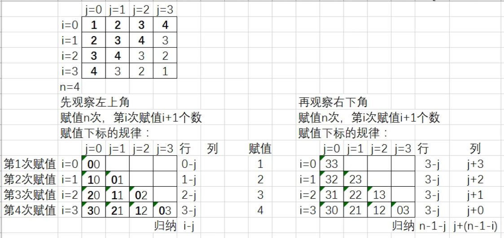
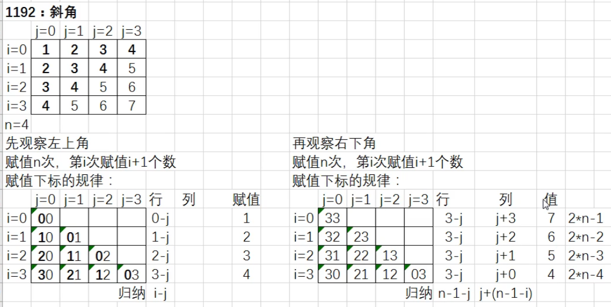
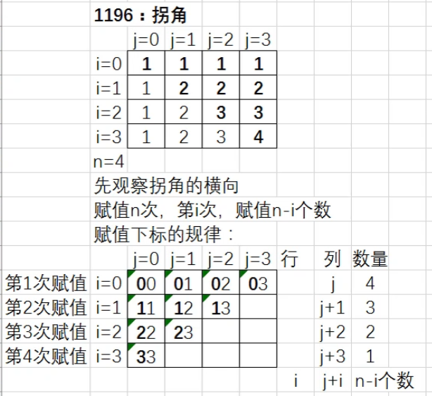
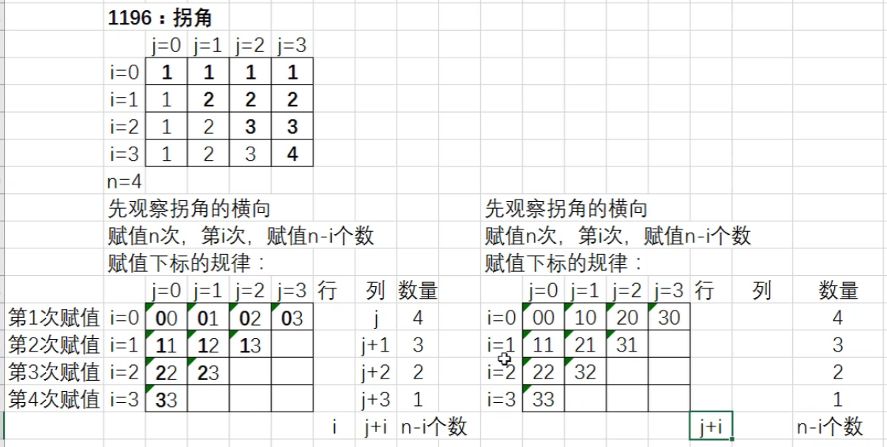
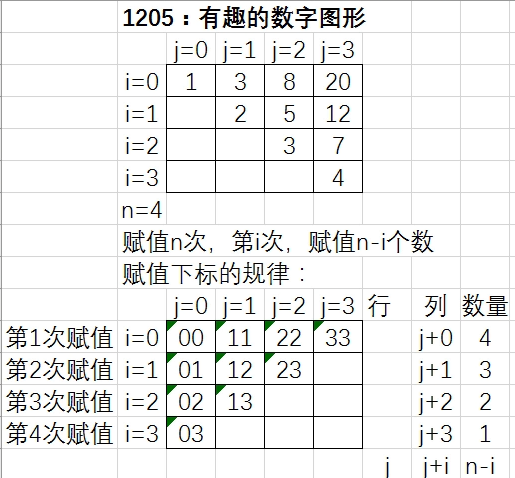

# 21.2、二维数组

## 四、 二维数组矩阵题解题思路

> (1)  观察二维数组需要赋值几次；
> 
> (2)  观察二维数组，第i次赋值几个数，这几个数的下标规律是什么；
> 
> (3)  观察赋值的规律；

#### 1190【入门】对角线I


```CPP
/*1190 - 【入门】对角线I
题目描述
输入整数N，输出相应方阵。

输入
一个整数N。（ 0 < n < 10 )

输出
一个方阵，每个数字的场宽为3。

样例
输入
5
输出
  1  0  0  0  0
  0  1  0  0  0
  0  0  1  0  0
  0  0  0  1  0
  0  0  0  0  1
来源
二维数组

标签
二维数组
*/
#include <bits/stdc++.h>
using namespace std;
int main() {
  int n;
  cin >> n;
  int a[11][11];
  //解法1
  for (int i = 1; i <= n; i++) {
    for (int j = 1; j <= n; j++) {
      if (i == j)
        cout << setw(3) << 1 ;
      else
        cout << setw(3) << 0 ;
    }
    cout << endl;
  }
  return 0;
}
```

```CPP
  //解法2，先写入数组数据  
  for (i = 0; i < n; i++) {
    a[i][i] = 1;
  }
  //再循环输出数据
  for (i = 0; i < n; i++) {
    //循环列
    for (j = 0; j < n; j++) {
      cout << setw(3) << a[i][j];
    }
    //第i行输出结束，输出换行
  }
```

#### 1191 [入门】对角线II


```CPP
/*1191 - 【入门】对角线II
题目描述
输入整数N，输出相应方阵。

输入
一个整数N。（ 0 < n < 10 )

输出
一个方阵，每个数字的场宽为3。

样例
输入
5
输出
  0  0  0  0  1
  0  0  0  1  0
  0  0  1  0  0
  0  1  0  0  0
  1  0  0  0  0
来源
二维数组

标签
二维数组
*/
#include <bits/stdc++.h>
using namespace std;

int a[20][20];
int main() {
  int n, i, j;
  cin >> n;
  //循环赋值元素的个数，赋值n个数
  //该循环表示，循环赋值元素的个数
  for (i = 0; i < n; i++) {
    a[i][n - 1 - i] = 1;
  }
  //输出
  //循环行
  for (i = 0; i < n; i++) {
    //循环列
    for (j = 0; j < n; j++) {
      cout << setw(3) << a[i][j];
    }
    //第i行输出结束，输出换行
    cout << endl;
  }
  return 0;
}
```

#### 1184**【入门】数字走向**I

|     | 0   | 1   | 2   | 3   |
| --- | --- | --- | --- | --- |
| 0   | 1   | 2   | 3   | 4   |
| 1   | 5   | 6   | 7   | 8   |
| 2   | 9   | 10  | 11  | 12  |
| 3   | 13  | 14  | 15  | 16  |


```CPP
/*1184 - 【入门】数字走向I
题目描述
输入整数N，输出相应方阵。

输入
一个整数N。（ 0 < n < 10 )

输出
一个方阵，每个数字的场宽为3。

样例
输入
5
输出
  1  2  3  4  5
  6  7  8  9 10
 11 12 13 14 15
 16 17 18 19 20
 21 22 23 24 25
来源
二维数组

标签
二维数组
*/
#include <bits/stdc++.h>
using namespace std;
int main() {
  int a[20][20] = {0}, i, j, n, x = 1;
  cin >> n;
  //赋值n次
  // i:代表赋值的次数
  for (i = 0; i < n; i++) {
    //第i次要赋值n个数
    // j代表第i次赋值元素的个数
    for (j = 0; j < n; j++) {
      a[i][j] = x;
      x++;
    }
  }
  //循环输出
  for (i = 0; i < n; i++) {
    for (j = 0; j < n; j++) {
      cout << setw(3) << a[i][j];
    }
    cout << endl;
  }
}
```

#### 1185【入门】数字走向II

|     | 0   | 1   | 2   | 3   |
| --- | --- | --- | --- | --- |
| 0   | 13  | 14  | 15  | 16  |
| 1   | 9   | 10  | 11  | 12  |
| 2   | 5   | 6   | 7   | 8   |
| 3   | 1   | 2   | 3   | 4   |

 

```CPP
  for (i = 0; i < n; i++) {
    //第i次要赋值n个数
    // j代表第i次赋值元素的个数
    for (j = 0; j < n; j++) {
      a[n-1-i][j] = x;
      x++;
    }
  }
```

#### 1186【入门】数字走向III


|     | 0   | 1   | 2   | 3   |
| --- | --- | --- | --- | --- |
| 0   | 1   | 5   | 9   | 13  |
| 1   | 2   | 6   | 10  | 14  |
| 2   | 3   | 7   | 11  | 15  |
| 3   | 4   | 8   | 12  | 16  |

```CPP
  for (i = 0; i < n; i++) {
    //第i次要赋值n个数
    // j代表第i次赋值元素的个数
    for (j = 0; j < n; j++) {
      a[j][i] = x;
      x++;
    }
  }
```

#### 1187【入门】数字走向IV

|     | 0   | 1   | 2   | 3   |
| --- | --- | --- | --- | --- |
| 0   | 13  | 9   | 5   | 1   |
| 1   | 14  | 10  | 6   | 2   |
| 2   | 15  | 11  | 7   | 3   |
| 3   | 16  | 12  | 8   | 4   |


```CPP
  for (i = 0; i < n; i++) {
    //第i次要赋值n个数
    // j代表第i次赋值元素的个数
    for (j = 0; j < n; j++) {
      a[j][n - 1 - i] = x;
      x++;
    }
  }
```

#### 1193:【入门】斜角II




```CPP
/*1193 - 【入门】斜角II
题目描述
输入整数N，输出相应方阵。

输入
一个整数N。（ 0 < n < 10 )

输出
一个方阵，每个数字的场宽为3。

样例
输入
5
输出
  1  2  3  4  5
  2  3  4  5  4
  3  4  5  4  3
  4  5  4  3  2
  5  4  3  2  1
来源
二维数组

标签
二维数组
*/
#include <bits/stdc++.h>
using namespace std;
int main() {
  int a[20][20] = {0}, i, j, n;
  cin >> n;
  //循环赋值的次数
  for (i = 0; i < n; i++) {
    //第i次赋值的个数
    for (j = 0; j <= i; j++) {
      a[i - j][j] = i + 1;                    //左上角
      a[n - 1 - j][j + (n - 1 - i)] = i + 1;  //右下角
    }
  }
  //输出
  for (i = 0; i < n; i++) {
    for (j = 0; j < n; j++) {
      cout << setw(3) << a[i][j];
    }
    cout << endl;
  }
  return 0;
}
```

#### 1192:**【入门】斜角**I

 1  2  3  4  5

 2  3  4  5  6

 3  4  5  6  7

 4  5  6  7  8

 5  6  7  8  9



```CPP
      a[n - 1 - j][j + (n - 1 - i)] = 2 * n - i - 1;  //右下角
```

#### 1196:**【入门】拐角**I





```CPP
/*1196 - 【入门】拐角I
题目描述
输入整数N，输出相应方阵。

输入
一个整数N。（ 0 < n < 10 )

输出
一个方阵，每个数字的场宽为3。

样例
输入
5
输出
  1  1  1  1  1
  1  2  2  2  2
  1  2  3  3  3
  1  2  3  4  4
  1  2  3  4  5
来源
二维数组

标签
二维数组
*/
#include <bits/stdc++.h>
using namespace std;
int main() {
  int a[20][20]={0};
  int n, i, j;
  cin >> n;
  //循环赋值元素的个数，赋值n个数
  //该循环表示，循环赋值元素的个数

//方法1
     for (i = 0; i < n; i++) {
      //第i次，赋值的元素的个数
      for (j = 0; j < n - i; j++) {
        a[i][j + i] = i + 1;  //横向
        a[j + i][i] = i + 1;  //纵向
      }
    } 
//方法2
/*  for (i = 0; i < n; i++) {
    for (j = 0; j < n; j++) {
      if (i <= j)
        a[i][j] = i + 1;
      else
        a[i][j] = j + 1;
    }
  }*/
//方法3
  /*   for (int i = 0; i < n; i++) {
      for (int j = 0; j < n; j++) {
        a[i][j] = i + 1;
      }
      for (int j = 0; j < i; j++) {
        a[i][j] = j + 1;
      }
    } */

  //输出
  for (i = 0; i < n; i++) {    //循环行
    for (j = 0; j < n; j++) {  //循环列
      cout << setw(3) << a[i][j];
    }
    cout << endl;  //第i行输出结束，输出换行
  }
  return 0;
}
```

1205【入门】有趣的数字图形II



```CPP
/*1205 - 【入门】有趣的数字图形II
题目描述
输入一个整数n（n≤12），打印出如下要求的方阵：左上到右下对角线上的数与行数相同，右上半个区域中每个元素等于左边的和下面的元素之和。每个元素场宽为5。左下半个区域为空。

输入
一个整数n（n≤12）

输出
n*n的方阵（场宽为5）。

样例
输入
4
输出
    1    3    8   20
         2    5   12
              3    7
                   4
来源
二维数组

标签
二维数组
*/
#include <bits/stdc++.h>
using namespace std;
int main() {
  /*第一个斜角单独赋值;
  其余的斜角的元素=该元素左侧元素+该元素下方元素
  */
  int a[20][20] = {0}, n, i, j;
  cin >> n;
  //循环赋值的次数
  for (i = 0; i < n; i++) {
    //循环赋值元素的个数
    for (j = 0; j < n - i; j++) {
      //如果是第一个斜角(第一次赋值)
      if (i == 0) {
        a[j][j + i] = j + 1;
      } else {
        //其余斜角
        a[j][j + i] = a[j][j + i - 1] + a[j + 1][j + i];
      }
    }
  }
  //输出
  for (i = 0; i < n; i++) {
    for (j = 0; j < n; j++) {
      if (a[i][j] != 0) {
        cout << setw(5) << a[i][j];
      } else {
        cout << setw(5) << ' ';
      }
    }
    cout << endl;
  }
  return 0;
}
```

## 五、二维数组矩阵题作业

1188:【入门】数字走向V

1189:【入门】数字走向VI

1192:【入门】斜角I

1195:【入门】斜角IV

1194:【入门】斜角III

1197:【入门】拐角II

1198:【入门】拐角III

1199:【入门】拐角IV

1204:【入门】有趣的数字图形I

1206:【入门】有趣的数字图形III

1207:【入门】有趣的数字图形IV

1385:【入门】有趣的数字图形

1327:【入门】鲜花方阵

## 六、二维数组应用问题

1315:【入门】遥控飞机争夺赛

思路：将选手的成绩和编号以成绩为排序标准，同步排序！

int a[100] [6],**存放每个选手的编号和**5**次成绩**

| 18  | 58  | 59  | 57  | 56  | 50  |
| --- | --- | --- | --- | --- | --- |
|     |     |     |     |     |     |
|     |     |     |     |     |     |

doble avg[100],存放每位选手成绩的平均值
| 61.333 |     |     | ... |     |     |
| ------ | --- | --- | --- | --- | --- |

int num[100],存放每位选手的编号
| 18  |     |     | ... |     |     |
| --- | --- | --- | --- | --- | --- |

```CPP
/*1315 - 【入门】遥控飞机争夺赛
题目描述
红太阳杯遥控飞机大赛拉开帷幕。比赛规则为，每位选手让自己的飞机从起点到终点飞行5次，组委会记录5次的飞行的成绩之后去掉一个最大成绩、一个最小成绩后计算剩余3个成绩的平值（平均分保留3位小数）作为该选手的最终成绩。
有n名选手参加了比赛，从键盘读入每位选手的编号以及他们的5次飞行的成绩。
请根据n名选手的比赛成绩，编程计算出冠军、亚军、季军的编号以及组委会计算出的成绩。（假设不存在多名选手成绩正好一样）（4.1.51）

输入
第一行为一个整数n，代表参加比赛的选手数量（n>=4 && n<=100）
后面的n行，每行有6个数，第一个数是选手的编号，后5个数为选手的5次飞行的成绩

输出
3行，第一行输出冠军的编号及飞行成绩（保留3位小数）用空格隔开2个数；第二行输出亚军的编号及飞行成绩，第三行输出季军的编号及飞行成绩

样例
输入
4
11 58 59 60 61 62
18 59 60 61 62 63
23 65 64 63 62 62
10 60 61 61 65 62
输出
23 63.000
10 61.333
18 61.000
来源
二维数组 容器 结构体

标签
二维数组容器结构体
*/
#include <bits/stdc++.h>
using namespace std;
int main() {
 int a[100][6] = {0}, num[100] = {0}, max, min, sum;
 double avg[100] = {0};  //存储平均分
 int i, j, n;
 cin >> n;
 for (i = 0; i < n; i++) {
   //读入6个数据
   for (j = 0; j < 6; j++) {
     cin >> a[i][j];
   }
   //求出均分
   max = a[i][1];
   min = a[i][1];
   sum = 0;
   for (j = 1; j < 6; j++) {
     sum = sum + a[i][j];
     if (a[i][j] > max) {
       max = a[i][j];
     }
     if (a[i][j] < min) {
       min = a[i][j];
     }
   }
   //存储平均分
   avg[i] = (sum - max - min) * 1.0 / 3;
   //存储编号
   num[i] = a[i][0];
 }
 /*   for (i = 0; i < n; i++) {
     cout << num[i] << " " << avg[i] << endl;
   } */
 //对于均分s数组按照由大到小排序(交换s数组元素的同时,交换num数组的元素)
 for (i = 1; i < n; i++) {
   for (j = 0; j <= n - i - 1; j++) {
     if (avg[j] < avg[j + 1]) {
       swap(avg[j], avg[j + 1]);  //交换变量的值
       swap(num[j], num[j + 1]);
     }
   }
 }
 //输出前3名
 for (i = 0; i < 3; i++) {
   cout << num[i] << " " << fixed << setprecision(3) << avg[i] << endl;
 }
}
```

1273:**【基础】哥德巴赫猜想的所有解**

```CPP
/*1273 - 【基础】哥德巴赫猜想的所有解
题目描述
求出哥德巴赫猜想的所有解（将一个大于9的奇数拆分成三个素数之和），并按从小到大的顺序写出。

输入
一行，一个大于9的奇数。

输出
第一行，一个整数N，表示解的总数。 第2-N+1行，每行一个解。

样例
输入
15
输出
3
15=2+2+11
15=3+5+7
15=5+5+5
来源
二维数组

标签
二维数组
*/
#include <bits/stdc++.h>
using namespace std;
bool sushu(int n) {
  bool r = true;  //假设n是素数
  //循环2 ~sqrt(n), 有因子就不是素数(注意如果n<=1也不是)
  int i;
  for (i = 2; i <= sqrt(n); i++) {
    if (n % i == 0 || n <= 1) {
      r = false;
      return r;  //停止循环
    }
  }
  return r;
}
int main() {
  int n;
  cin >> n;
  int a[10000][3], m = 0;
  for (int i = 2; i <= n / 3; i++) {
    for (int j = i; j <= (n - i) / 2; j++) {
      for (int k = j; k <= n - i - j; k++) {
        if (sushu(i) && sushu(j) && sushu(k) && n == i + j + k) {
          a[m][0] = i;
          a[m][1] = j;
          a[m][2] = k;
          m++;
        }
      }
    }
  }
  cout << m << endl;
  for (int i = 0; i < m; i++) {
    cout << n << "=" << a[i][0] << "+" << a[i][1] << "+" << a[i][2] << endl;
  }
  return 0;
}
```

## 七、二维数组应用题作业

1346:【入门】等比例缩放照片

1210:【基础】马鞍数

1347:【基础】游览动物园